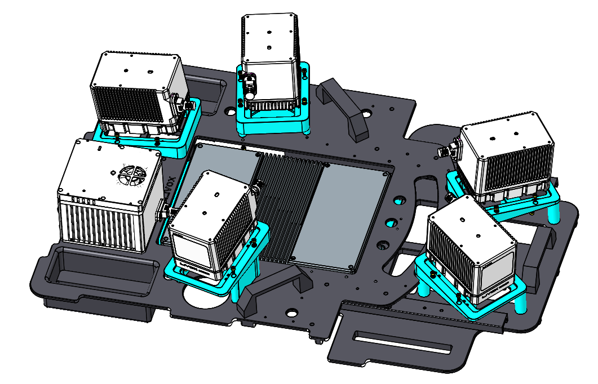

========================================
官方开源资料汇总
========================================

驱动
--------------
  
Livox SDK
~~~~~~~~~~~~~~~~~~~~~~

Livox SDK是为Livox公司旗下所有产品设计的软件开发套件。它基于C/C++语言开发，遵循Livox SDK通信协议，并为用户提供了易用的C语言风格的接口。通过Livox SDK,用户可以快速地连接Livox产品并接收点云数据。详情及安装见 `Livox SDK <https://github.com/Livox-SDK/Livox-SDK>`_

Livox ROS Driver
~~~~~~~~~~~~~~~~~~~~~~

Livox ROS driver是一个全新的ROS包，专门用于连接览沃生产的LiDAR产品。该驱动程序可以在安装了ROS环境（indigo,kinetic,melodic）的ubuntu14.04/16.04/18.04操作系统下运行。经测试可以运行览沃ROS驱动程序的硬件平台包括：intel x86主流cpu平台，部分ARM64硬件平台（如，nvida TX2/Xavier等）。详情及安装见 `Livox ROS Driver <https://github.com/Livox-SDK/livox_ros_driver>`_

Livox Apollo Driver
~~~~~~~~~~~~~~~~~~~~~~

览沃Apollo驱动用于将Livox\_Lidar扫描得到的原始数据文件转化为标准点云格式文件，并写入点云通道。详情及安装见 `Livox Apollo Driver <https://github.com/Livox-SDK/livox_apollo_driver>`_

工具
--------------

Livox Viewer
~~~~~~~~~~~~~~~~~~~~~~

Livox Viewer 是一款专为Livox激光探测测距仪和Liovx Hub设计的，可用于实时显示连接至计算机的所有激光探测测距仪点云数据的软件。通过Livox Viewer，用户可轻松查看、记录并储存点云数据，以便后期使用。详细说明可见Livox官网 `Livox Viewer使用手册 <https://github.com/Livox-SDK/Livox-Viewer>`_，下载地址如下：

`Livox Viewer 0.11.0 (64bit) - Windows <https://terra-1-g.djicdn.com/65c028cd298f4669a7f0e40e50ba1131/Download/update/Livox%20Viewer%200.11.0.zip>`_

`Livox Viewer 0.10.0(64bit) - Ubuntu 16.04 <https://terra-1-g.djicdn.com/65c028cd298f4669a7f0e40e50ba1131/Download/update/Livox_Viewer_For_Linux_Ubuntu16.04_x64_0.10.0.tar.gz>`_

开源算法
--------------

LIO-Livox
~~~~~~~~~~~~~~~~~~~~~~

LIO-Livox是针对Livox Lidar开发的一个鲁棒、低漂移、实时的紧耦合里程计和绘图软件包。该软件包主要针对建图定位设计，并解决了许多关键问题如有限视场下的特征提取和选择和运动失真补偿等。详情见：
`LIO-Livox <https://github.com/Livox-SDK/LIO-Livox>`_

livox_cloud_undistortion
~~~~~~~~~~~~~~~~~~~~~~

livox_cloud_undistortion是针对Livox Lidar开发的畸变修正模块。该模块利用雷达自带IMU对旋转运动失真进行补偿，并且开放了平移运动补偿接口。详情见：
`livox_cloud_undistortion <https://github.com/Livox-SDK/livox_cloud_undistortion>`_；
`相关文章 <https://forum.livoxtech.com/thread-199-1-1.html>`_ 

Livox-Free-Space
~~~~~~~~~~~~~~~~~~~~~~~~~~~~~~~~~~~~~~~~~~~~~~~~~~~~~~~~~~~~~~~~~~

针对 Livox 雷达的可行使区域检测算法模块。详情见：
`Livox-Free-Space <https://github.com/Livox-SDK/livox_free_space>`_

Livox Horizon Calibration
~~~~~~~~~~~~~~~~~~~~~~~~~~~~~~~~~~~~~~~~~~~~~~~~~~~~~~~~~~~~~~~~~~

针对Livox Horizon外参标定工具。详情见：
`Livox Horizon Calibration <https://github.com/Livox-SDK/livox_calibration>`_

livox scanner
~~~~~~~~~~~~~~~~~~~~~~

livox scanner是一个3D扫描解决方案，主要包括一个Mid-40激光雷达、Manifold 2计算平台，以及一个带编码器的GM6020电机。LiDAR和电机安装在三脚架顶端，Mid-40将绕Z轴旋转，扫描空间内不同区域，点云数据融合电机角度后得到空间中的3维图像。系统搭建过程及详细代码见：
`livox scanner <https://github.com/Livox-SDK/livox_scanner>`_

livox high precision mapping
~~~~~~~~~~~~~~~~~~~~~~~~~~~~~~~~~~~~~~~~~~~~~~~~~~~~~~~~~~~~~~~~~~

该方案使用探测距离达260m，精度2cm，非重复扫描方式的Mid-40激光雷达传感器，结合APX-15惯导模块提供的高精度位置，姿态数据，实现实时的高精度建图功能。详情见：
`livox high precision mapping <https://github.com/Livox-SDK/livox_high_precision_mapping>`_

livox camera lidar calibration
~~~~~~~~~~~~~~~~~~~~~~~~~~~~~~~~~~~~~~~~~~~~~~~~~~~~~~~~~~~~~~~~~~

该方案提供了一个手动标定Livox雷达和相机之间外参的方法，已经在Mid-40，Horizon和Tele-15上进行了验证。其中包含了计算相机内参，获得标定数据，优化计算外参和雷达相机融合应用相关的代码。本方案中使用了棋盘格作为标定目标物，由于Livox雷达非重复性扫描的特点，点云的密度较大，比较易于找到雷达点云中角点的准确位置。相机雷达的标定和融合也可以得到不错的结果。详情见：
`livox camera lidar calibration <https://github.com/Livox-SDK/livox_camera_lidar_calibration>`_

Horizon Highway SLAM
~~~~~~~~~~~~~~~~~~~~~~

Horizon是Livox自主研发的对标L3级与L4级自动驾驶的高性能雷达，Horizon Highway SLAM是基于Horizon雷达开发的适用于高速运动场景的稳定、低漂移和实时的建图工具包。该算法适用0~80km/h的速度场景，并解决了极窄FOV内的特征提取、运动畸变补偿和通过多传感器融合以避免场景退化等技术难题。详情见：
`Horizon Highway SLAM <https://github.com/Livox-SDK/horizon_highway_slam>`_

Livox-Relocalization
~~~~~~~~~~~~~~~~~~~~~~

Livox-Relocalization是Livox开发的针对Livox Lidar的重定位软件包，可帮助用户加载使用Mid-40采集的地图并使用地图重定位雷达的位置信息。详情可见：
`Livox-Relocalization <https://github.com/Livox-SDK/livox_relocalization>`_

文档与手册
--------------

Livox Viewer用户手册
~~~~~~~~~~~~~~~~~~~~~~

下载地址：
`Livox Viewer <https://www.livoxtech.com/3296f540ecf5458a8829e01cf429798e/downloads/Livox%20Viewer/Livox%20Viewer%20%E7%94%A8%E6%88%B7%E6%89%8B%E5%86%8C.pdf>`_

延长线转接盒安装模型
~~~~~~~~~~~~~~~~~~~~~~

下载地址：
`延长线转接盒安装模型 <https://terra-1-g.djicdn.com/65c028cd298f4669a7f0e40e50ba1131/Download/extend_coupler_asm.stp>`_

Livox点云特性
~~~~~~~~~~~~~~~~~~~~~~

下载地址：
`Livox点云特性 <https://www.livoxtech.com/3296f540ecf5458a8829e01cf429798e/downloads/Livox%20%E7%82%B9%E4%BA%91%E7%89%B9%E6%80%A7.pdf>`_

Livox Avia相关
~~~~~~~~~~~~~~~~~~~~~~

-  Livox Avia相关资料文档介绍下载地址 `Livox Avia相关资料文档介绍 <https://github.com/Livox-SDK/livox_wiki_cn/raw/master/source/doc/Livox%20Avia%E7%9B%B8%E5%85%B3%E8%B5%84%E6%96%99%E6%96%87%E6%A1%A3%E4%BB%8B%E7%BB%8D.pdf>`_

Livox Horizon相关
~~~~~~~~~~~~~~~~~~~~~~

-  浩界Horizon用户手册下载地址 `浩界Horizon用户手册 <https://terra-1-g.djicdn.com/65c028cd298f4669a7f0e40e50ba1131/Download/update/Livox%20Horizon%20User%20Manual%20(CN).pdf>`_

-  浩界Horizon快速入门指南下载地址 `浩界Horizon快速入门指南 <https://www.livoxtech.com/3296f540ecf5458a8829e01cf429798e/assets/horizon/Livox%20Horizon%20%E5%BF%AB%E9%80%9F%E5%85%A5%E9%97%A8%E6%8C%87%E5%8D%97%EF%BC%88%E5%A4%9A%E8%AF%AD%E8%A8%80).pdf>`_

-  Livox Horizon相关资料介绍文档下载地址 `Livox Horizon相关资料介绍文档 <https://github.com/Livox-SDK/livox_wiki_cn/raw/master/source/doc/Livox%20Horizon%E7%9B%B8%E5%85%B3%E8%B5%84%E6%96%99%E4%BB%8B%E7%BB%8D%E6%96%87%E6%A1%A3.pdf>`_

Livox Mid相关
~~~~~~~~~~~~~~~~~~~~~~

-  Livox觅道系列用户手册v1.0下载地址 `Livox觅道系列用户手册v1.0 <https://terra-1-g.djicdn.com/65c028cd298f4669a7f0e40e50ba1131/Download/update/Livox%20Mid%20Series%20User%20Manual%20(CN).pdf>`_

-  Livox觅道-40 快速入门指南v1.4下载地址 `Livox觅道-40 快速入门指南v1.4 <https://www.livoxtech.com/3296f540ecf5458a8829e01cf429798e/downloads/20190530/Livox%20Mid-40%20Quick%20Start%20Guide%20multi%20v1.4.pdf>`_

-  Livox觅道-100快速入门指南v1.4下载地址 `Livox觅道-100 快速入门指南v1.4 <https://www.livoxtech.com/3296f540ecf5458a8829e01cf429798e/downloads/20190530/Livox%20Mid-100%20Quick%20Start%20Guide%20multi%20v1.4.pdf>`_

-  觅道-40 3D Model and FOV Shape下载地址 `觅道-40 3D Model and FOV Shape <https://www.livoxtech.com/3296f540ecf5458a8829e01cf429798e/downloads/MID-40%203D%20Model%20and%20FOV%20Shape.zip>`_

-  觅道-100 3D Model and FOV Shape下载地址 `觅道-100 3D Model and FOV Shape <https://www.livoxtech.com/3296f540ecf5458a8829e01cf429798e/downloads/MID-100%203D%20Model%20and%20FOV%20Shape.zip>`_

-  Livox Mid-70相关资料文档介绍下载地址 `Livox Mid-70相关资料文档介绍 <https://github.com/Livox-SDK/livox_wiki_cn/raw/master/source/doc/Livox%20Mid-70%E7%9B%B8%E5%85%B3%E8%B5%84%E6%96%99%E6%96%87%E6%A1%A3%E4%BB%8B%E7%BB%8D.pdf>`_

Livox_Tele相关
~~~~~~~~~~~~~~~~~~~~~~

-  泰览Tele-15 3D Model and FOV Shape下载地址 `泰览Tele-15 3D Model and FOV Shape <https://terra-1-g.djicdn.com/65c028cd298f4669a7f0e40e50ba1131/Download/Tele-15_shell_FOV_3D.stp>`_

-  泰览Tele-15 W/O Dissipation Module 3D Model下载地址 `泰览Tele-15 W/O Dissipation Module 3D Model <https://terra-1-g.djicdn.com/65c028cd298f4669a7f0e40e50ba1131/Download/Tele-15_withou_self_dissipation_module.stp>`_

-  Livox Tele相关资料介绍文档下载地址 `Livox Tele相关资料介绍文档 <https://github.com/Livox-SDK/livox_wiki_cn/raw/master/source/doc/Livox%20Tele%E7%9B%B8%E5%85%B3%E8%B5%84%E6%96%99%E4%BB%8B%E7%BB%8D%E6%96%87%E6%A1%A3.pdf>`_

Livox Hub相关
~~~~~~~~~~~~~~~~~~~~~~

-  Livox Hub用户手册v1.2下载地址 `Livox Hub用户手册v1.2 <https://terra-1-g.djicdn.com/65c028cd298f4669a7f0e40e50ba1131/Download/Livox%20%E6%9E%A2%E7%BA%BD%E7%94%A8%E6%88%B7%E6%89%8B%E5%86%8C.pdf>`_

-  Livox Hub快速入门指南v1.0下载地址 `Livox Hub快速入门指南v1.0 <https://www.livoxtech.com/3296f540ecf5458a8829e01cf429798e/downloads/20190318/Livox%20Hub%20Quick%20Start%20Guide%20v1.0.pdf>`_

-  Livox Hub 3D模型下载地址 `Livox Hub 3D模型 <https://www.livoxtech.com/3296f540ecf5458a8829e01cf429798e/downloads/20190318/Livox%20Hub%203D%20Model.zip>`_

点云范例数据
----------------

Livox Horizon点云数据
~~~~~~~~~~~~~~~~~~~~~~

-  数据包1下载地址 `Livox Horizon 点云数据包1 <https://terra-1-g.djicdn.com/65c028cd298f4669a7f0e40e50ba1131/Download/Horizon_%E9%81%93%E8%B7%AF%E5%9C%BA%E6%99%AF%E7%82%B9%E4%BA%91%E6%95%B0%E6%8D%AE_%E5%AE%98%E7%BD%91.lvx>`_

-  数据包2下载地址 `Livox Horizon 点云数据包2 <https://www.livoxtech.com/3296f540ecf5458a8829e01cf429798e/downloads/20200107/Sample%20Point%20Cloud%20of%20Horizon.zip>`_ 

Livox Mid-100点云数据
~~~~~~~~~~~~~~~~~~~~~~

-  数据包1下载地址 `Livox Mid 点云数据包1 <https://www.livoxtech.com/3296f540ecf5458a8829e01cf429798e/downloads/Livox%20Mid-100%20Point%20Cloud%20Data%201.zip>`_

-  数据包2下载地址 `Livox Mid 点云数据包2 <https://www.livoxtech.com/3296f540ecf5458a8829e01cf429798e/downloads/Livox%20Mid-100%20Point%20Cloud%20Data%202.zip>`_

雷达车载支架
----------------------------

-  Livox开源车载雷达支架

资料下载 `Livox车载雷达支架说明文档及开源资料 <https://github.com/Livox-SDK/livox_wiki_cn/tree/master/source/data>`_
