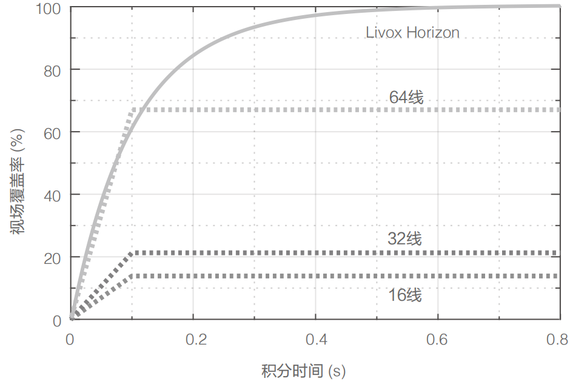
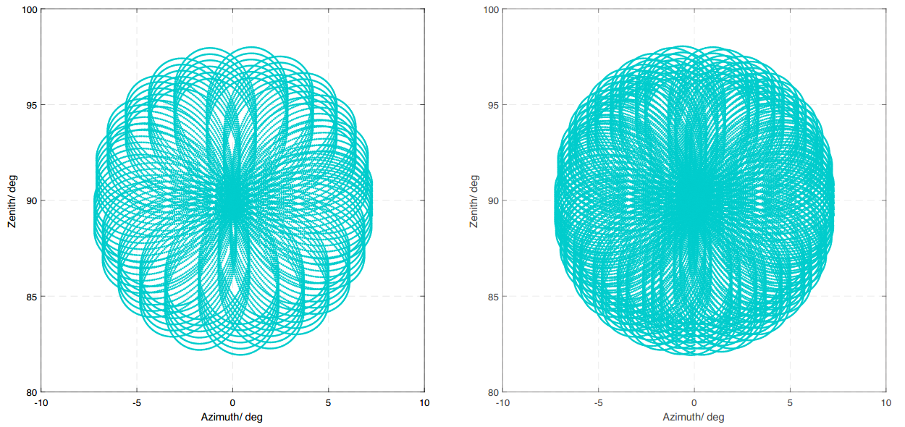

========================================
Livox的点云属性与惯性坐标系
========================================

点云属性
~~~~~~~~~~~~~~~~~~~~~~

**觅道Mid系列**

Livox_LiDAR可准确感知复杂周围环境，提供详尽点云数据信息，适用于高级驾驶辅助系统、无人驾驶汽车、机器人、直升机、无人机避障及安全巡检等领域。下面以Mid系列和Horizon系列为例介绍Livox_LiDAR点云特点及参数：

Livox Mid-40以及Livox Mid-100通过使用非重复扫描技术，具有较高的视场覆盖率，且随着积分时间的增大，视场覆盖率也会显著增大，探测到视场中的更多细节。下图所示为不同积分时间内（分别为0.1s，0.2s，0.5s和1s时Livox Mid-40和 Mid-100的点云图。每个Livox Mid-100的点云图都可以视为由三个Livox Mid-40的点云图所组成。
   
Livox Mid-40不同积分时间内点云效果图如下所示：
   
.. image:: ../image/Mid-40_point_cloud_photo.png

Livox Mid-100不同积分时间内点云效果图如下所示：

.. image:: ../image/Mid-100_point_cloud_picture.png
   
下图给出了不同积分时间下Livox Mid-40激光探测测距仪的视场覆盖率，和当前市场上常见的几款多线机械旋转式激光探测测距仪的相关数据。从图中可以看出，当积分时间小于0.1s时，Livox Mid-40的视场覆盖率性能与某32线产品的性能相当；当积分时间增大时，Livox Mid-40的视场覆盖率明显提高而某32线产品的视场覆盖率保持不变。当积分时间是0.5s时，视场覆盖率与某64线产品相当；当积分时间继续增大，达到1.4s时，视场覆盖率将会接近100%，即视场中几乎所有区域都会被激光束照射到。

.. image:: ../image/Mid-40_FOV_coverage.png

Mid系列点云参数如下表所示：

+--------------------+---------------------------------------------------------------------+
| 参数名称           | 参数数值                                                            |
+====================+=====================================================================+
| 激光波长           | 905nm                                                               |
+--------------------+---------------------------------------------------------------------+
| 安全级别           | Class 1(IEC 60825-1:2014)人眼安全                                   |
+--------------------+---------------------------------------------------------------------+
| 量程(@100klx)      | 90m@10%反射率；130m@20%反射率；260m@80%反射率                       |
+--------------------+---------------------------------------------------------------------+
| FOV                | Livox Mid-40：38.4°(圆形);Livox Mid-100：98.4°(水平)× 38.4°(竖直)   |
+--------------------+---------------------------------------------------------------------+
| 距离精度(1σ@20m)   | 2cm                                                                 |
+--------------------+---------------------------------------------------------------------+
| 角度精度           | <0.1°                                                               |
+--------------------+---------------------------------------------------------------------+
| 光束发散角度       | 0.28°(竖直)×0.03°(水平)                                             |
+--------------------+---------------------------------------------------------------------+
| 数据率             | Livox Mid-40：100,000点/秒;Livox Mid-100：300,000点/秒              |
+--------------------+---------------------------------------------------------------------+
| 虚警率(@100klx)    | <0.01%                                                              |
+--------------------+---------------------------------------------------------------------+

**浩界Horizon系列**

Horizon采用Livox自主研发的高速非重复扫描技术和自主设计的多线封装激光器，同等时间内的点云视场覆盖率是Mid系列的三倍。随着积分时间的增大，点云视场覆盖率还会继续增大，探测到视场中的更多细节。

下面以Horizon在0.1s的扫描图案来说明点云分布。Horizon在中间区域的扫描密度大，扫描线间隔平均约0.2°（主要在0.1°-0.3°范围内），超过常见机械旋转式64线激光雷达。两边圆形区域的扫描密度比中间低，扫描线间隔平均在0.4°（主要在0.2°-0.8°范围内），0.1s的综合扫描效果与常见机械旋转式64线激光雷达相当。0.1s时间内Horizon点云分布图如下：（坐标单位：度）

.. image:: ../image/0.1sHorizon_point_cloud_sanning_picture.png

下面为不同积分时间内Horizon的点云图：

.. image:: ../image/Horizon_point_cloud_picture.png

下图给出了不同积分时间下Horizon的视场覆盖率，和当前市场上常见的几款多线机械旋转式激光探测测距仪的对比。从图中可以看出，当积分时间小于0.1s时，Horizon的视场覆盖率接近60%，即与常见64线机械旋转式激光雷达相当；当积分时间继续增大，达到0.5s左右时，视场覆盖率将会接近100%，即视场中几乎所有区域都会覆盖到。

Horizon系列点云参数如下表所示：

+-------------------+---------------------------------------------------------------------+
| 参数名称          | 参数数值                                                            |
+===================+=====================================================================+
| 激光波长          | 905nm                                                               |
+-------------------+---------------------------------------------------------------------+
| 安全级别          | Class 1(IEC 60825-1:2014)人眼安全                                   |
+-------------------+---------------------------------------------------------------------+
| 量程(@100klx)     | 90m@10%反射率；130m@20%反射率；260m@80%反射率                       |
+-------------------+---------------------------------------------------------------------+
| FOV               | 81.7°（水平)×25.1°（竖直)                                           |
+-------------------+---------------------------------------------------------------------+
| 距离随机误差      | （1σ@20m）<2cm                                                      |
+-------------------+---------------------------------------------------------------------+
| 角度随机误差      | 1σ<0.05°                                                            |
+-------------------+---------------------------------------------------------------------+
| 光束发散角度      | 0.28°(竖直)×0.03°(水平)                                             |
+-------------------+---------------------------------------------------------------------+
| 数据率            | 可配置第一回波或最强回波时：240,000 点/秒；双回波时：480,000点/秒   |
+-------------------+---------------------------------------------------------------------+
| 虚警率(@100klx)   | <0.01%                                                              |
+-------------------+---------------------------------------------------------------------+

**泰览Tele系列**

Tele-15采用Livox自主研发的高速非重复扫描技术和自主设计的多线封装激光器,同等时间内的点云视场覆盖率是Mid-40的5倍。随着积分时间的增大,点云视场覆盖率还会继续增大,探测到视场中的更多细节。

下图以Tele-15在0.1s的扫描图案来说明点云分布，左图为0.1s时间内Tele-15的点云分布图，右图为0.2s时间内Tele-15的点云分布图。Tele-15在中间区域的扫描密度非常高,可媲美300线传统激光雷达,其它区域优于100线激光雷达的扫描覆盖率。在Tele-15的FOV范围内0.1s的综合扫描效果与常见机械旋转式128线激光雷达相当。

根据 Livox 坐标系定义,方位角范围为 0°~360°,此处 -10°~0° 相当于 350°~360°。

下图给出了不同积分时间下Tele-15的视场覆盖率,和当前市场上常见的几款多线机械旋转式激光
探测测距仪的对比。从图中可以看出,当积分时间为0.1s时,Tele-15的视场覆盖率约为99%,高于
常见128线机械旋转式激光雷达。

.. image:: ../image/tele_coverage.png

Tele-15雷达点云参数如下表所示：

+-------------------+------------------------------------------------------------------------------------------+
| 参数名称          | 参数数值                                                                                 |
+===================+==========================================================================================+
| 激光波长          | 905nm                                                                                    |
+-------------------+------------------------------------------------------------------------------------------+
| 安全级别          | Class 1(IEC 60825-1:2014)人眼安全                                                        |
+-------------------+------------------------------------------------------------------------------------------+
| 量程(@100klx)     | 320m@10%反射率；500m@50%反射率                                                           |
+-------------------+------------------------------------------------------------------------------------------+
| FOV               | 14.5°（水平）×16.2°（竖直）                                                              |
+-------------------+------------------------------------------------------------------------------------------+
| 测距精度（1σ）    | <2cm（5-70m） ,<4cm（70-120m） @10%反射率；<2cm（5~220m） ,<4cm（220-380m） @80%反射率   |
+-------------------+------------------------------------------------------------------------------------------+
| 角度精度（1σ）    | <0.03°                                                                                   |
+-------------------+------------------------------------------------------------------------------------------+
| 光束发散角度      | 0.02°（水平）×0.12°（竖直）                                                              |
+-------------------+------------------------------------------------------------------------------------------+
| 点云输出          | 可配置第一回波或最强回波时：240,000 点/秒；双回波时：480,000点/秒                        |
+-------------------+------------------------------------------------------------------------------------------+
| 虚警率(@100klx)   | <0.01%                                                                                   |
+-------------------+------------------------------------------------------------------------------------------+

坐标系
~~~~~~~~~~~~~~~~~~~~~~

在多传感器智能体导航中，通常会安装多个传感器用以数据的融合与计算。需了解Livox
激光探测测距仪的直角坐标定义如下：

-  Livox Mid-40坐标定义：

.. image:: ../image/Livox_Mid-40__coordinate_system.png

-  Livox Horizon中内置IMU，点云坐标系O-XYZ和IMU坐标系O-X'Y'Z'的定义如下图所示：

.. image:: ../image/Livox_Horizon_coordinate_system.png

-  Livox Tele-15中内置IMU，点云坐标系O-XYZ和IMU坐标系O-X'Y'Z'的定义如下图所示：

.. image:: ../image/tele_Coordinate_System.png

其中IMU坐标原点O'在点云坐标系O-XYZ上的坐标为（-84.7，-42.5，-35.3）（单位：mm）

点云数据
~~~~~~~~~~~~~~~~~~~~~~

点云数据是激光探测测距仪于视场角中于被测物表面所探测到的所有点云的总和。每个点云包含以下信息：

-  目标反射率：

以0至255表示。其中0至150对应反射率介于0至100%的漫散射物体；而151至255对应全反射物体。

-  坐标信息：

Livox Horizon的坐标信息可表示为直角坐标（x，y，z）或球坐标（r，θ，φ），其直角坐标和球坐标的对应关系如下图所示。如果前方无被探测物体或者被探测物体超出量程范围（例如600m），在直角坐标系下，点云输出为（0，0，0）；在球坐标系下，点云输出为（0，θ，φ）。点云数据中球坐标与直角坐标关系如下所示：

.. image:: ../image/coordinate_transform.png

-  标记（Tag），主要指示多回波信息及噪点信息，其数据结构如下所示：

.. image:: ../image/tag.png

标记信息的格式如下：每个标记信息由1字节组成，该字节中bit7和bit6为第一组，bit5和bit4为第二组，bit3和bit2为第三组，bit1和bit0为第四组。第二组表示的是该采样点的回波次序。由于Livox Horizon采用同轴光路，即使外部无被测物体，其内部的光学系统也会产生一个回波，该回波记为第0个回波。随后，若激光出射方向存在可被探测的物体，则最先返回系统的激光回波记为第1个回波，随后为第2个回波，以此类推。如果被探测物体距离过近（例如1.5m），第1个回波将会融合到第0个回波里，该回波记为第0个回波。第三组基于回波能量强度判断采样点是否为噪点。通常情况下，激光光束受到类似灰尘、雨雾、雪等干扰产生的噪点的回波能量很小。目前按照回波能量强度大小将噪点置信度分为二档：01表示回波能量很弱，这类采样点有较高概率为噪点，例如灰尘点；10表示回波能量中等，该类采样点有中等概率为噪点，例如雨雾噪点。噪点置信度越低，说明该点是噪点的可能性越低。第四组基于采样点的空间位置判断是否为噪点。例如，激光探测测距仪在测量前后两个距离十分相近的物体时，两个物体之间可能会产生拉丝状的噪点。目前按照不同的噪点置信度分为三档，噪点置信度越低，说明该点是噪点的可能性越低。
