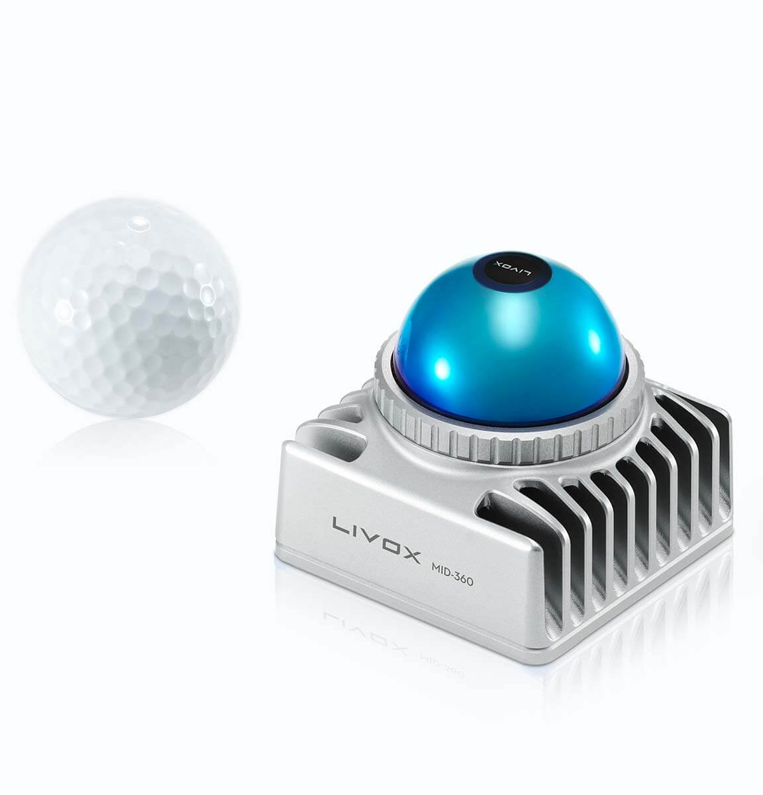
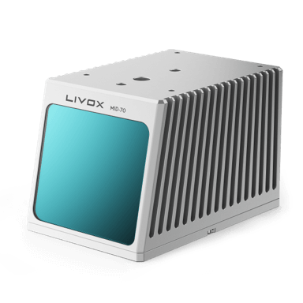

览沃科技有限公司（Livox）成立于2016年。为了革新激光雷达行业，Livox致力于提供高性能、低成本的激光雷达传感器。通过降低使用门槛和生产成本，Livox将激光雷达技术集成到更多产品和应用之中，从而为自动驾驶、智慧城市、测绘、移动机器人等行业带来创新性改变。Livox产品已销往包括美国、加拿大、中国、日本和欧盟在内的 26 个国家和地区。

产品
==========

新产品介绍
------------

浩界HAP
~~~~~~~~~~~~~~~~~~~~~~
Livox HAP 由 Livox 团队耗时两年精心打造，是 Livox 首款面向智能辅助驾驶市场研发的车规级激光雷达。HAP 探测距离提升至 150 米，HAP 横向视场角为 120°，通过双台部署，可为车前方提供最高至 180° 的超宽点云视野角分辨率高达 0.18°*0.23°, 其中感兴趣区域（ROI, Region of Interest） 的点云密度可等效 144 线激光雷达。点击了解详情：
`HAP <https://www.livoxtech.com/cn/hap>`_

.. image:: ../image/HAP.png

觅道Mid-360
~~~~~~~~~~~~~~~~~~~~~~
面向智能移动机器人市场，Livox 推出最新一代 3D 激光雷达 Mid-360，开启混合固态激光雷达 360° 立体感知新篇章。凭借小巧体积，Mid-360 的安装布置更加灵活。同时，Mid-360 充分考虑了移动机器人对导航、避障等升维感知的需求，兼容室内外场景，赋能移动机器人进入空间智能感知新时代。点击了解详情：
`Mid-360 <https://www.livoxtech.com/cn/mid-360>`_

其它产品介绍
------------

觅道Mid-70
~~~~~~~~~~~~~~~~~~~~~~
Mid-70 延续 Livox 高性价比的优势，更针对低速自动驾驶、移动机器人等应用领域进行优化设计，大幅提升垂直与水平方向视场角、减小盲区、提高近处精度，为机器人带来更全面的视野。点击了解详情：
`Mid-70 <https://www.livoxtech.com/cn/mid-70>`_

傲览Avia
~~~~~~~~~~~~~~~~~~~~~~
傲览 Avia 激光雷达轻巧紧凑的外形下探测距离及效率全面提升，FOV超过70°，支持三回波与双扫描模式，可广泛适用于电力、林业、泛测绘、智慧城市等等应用场合。点击了解详情：
`Avia <https://www.livoxtech.com/cn/avia>`_

.. image:: ../image/avia.png
    :align: center

泰览Tele
~~~~~~~~~~~~~~~~~~~~~~
泰览Tele-15激光雷达专为远距离、高精度探测打造，可感知500米外的障碍物，且体积小巧、可靠性强。可在高速行驶中为车辆带来更充裕的响应时间，保障安全。点击了解详情：
`Tele <https://www.livoxtech.com/cn/tele-15>`_

.. image:: ../image/tele-15.jpg

浩界Horizon
~~~~~~~~~~~~~~~~~~~~~~
浩界Horizon高性能激光雷达专为L3/L4自动驾驶打造，具备宽广水平视场、260米探测距离、高点云密度及便于嵌入车体的小巧体积，价格仅为同等性能激光雷达的1%。巨大的技术和成本优势将助力自动驾驶商业化量产落地。点击了解详情：
`Horizon <https://www.livoxtech.com/cn/horizon>`_

.. image:: ../image/horizon.jpg

觅道Mid
~~~~~~~~~~~~~~~~~~~~~~
觅道Mid系列是Livox研发的高性价比激光雷达，可探测远至260米的物体。独特的非重复采样策略，助其精确探测视场中每个细节。而这一切都蕴含于小巧的机身中，可轻松嵌入各种平台。现已实现大规模量产，可立即供货，助力移动机器人、园区物流、车路协同、测绘、安防等领域从小批量测试走向大规模应用。点击了解详情：
`Mid系列 <https://www.livoxtech.com/cn/mid-40-and-mid-100>`_

.. image:: ../image/mid.jpg

