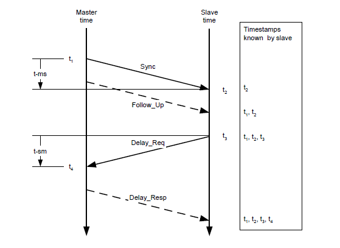
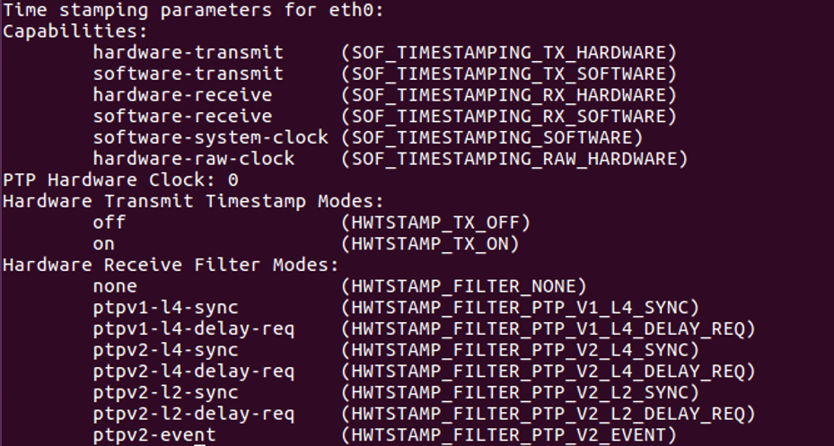
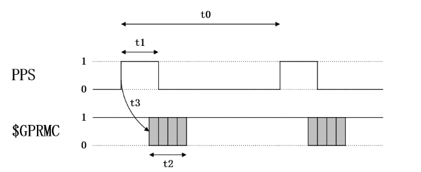

.. _时间同步:

=================
时间同步说明
=================

不同产品支持的同步方式不同，每个产品支持的同步方式详细见各产品页描述.

各种时间同步方式的应用场景
----------------------------

**(推荐)PTP/gPTP:**

在没有GPS和PPS硬件信号的情况下，PTP v2及gPTP可用于Livox LiDAR和其他设备之间的时间同步。这种方法所需要的外部硬件支持最少，只需要在整个网络中有一个master时钟设备即可。

**GPS:**

在其它传感器均直接通过GPS信号同步的情况下，直接硬件接入PPS信号以及GPS信号即可完成同步，无需另外部署软件；

.. _PTP时间同步:

PTP时间同步
----------------------------

PTP时间同步原理
~~~~~~~~~~~~~~~~~~~~~~~~~~~~

同步过程使用IEEE 1588v2.0 PTP的Delay request-response机制（two
steps），Livox设备作为slave端，和master时钟设备进行ptp时间同步。

master和slave时钟通过Sync、Follow_Up、Delay_Req、Delay_Resp这几个数据包的交互，得到t1、t2、t3、t4时间，通过如下计算得到传输路径延迟和两时钟的偏移：

传输路径延时：

.. math:: Delay = [(t4 – t1) – (t3 – t2)]/2

时间偏移：

.. math:: Offset = (t2 - t1) - Delay = [(t2 – t1) + (t3 – t4)]/2

PTP时间同步方法
~~~~~~~~~~~~~~~~~~~~~~~~~~~~

当Livox LiDAR连接到有ptp master时钟的网络中时，设备会自动同步自己的时间到主时钟。

**第一步：检查网络中的master时钟是否正常：**

PC上配置主时钟的方法可参考附录 :ref:`如何配置PTP主时钟`

如果网络中有Sync、Follow_Up这两个数据，则说明存在PTP
master时钟源，且正常工作：

.. figure:: ../../../image/timesync/wireshark_ptp.png
   :alt: image

**第二步：连接Livox设备**

通过网线正常连接Livox LiDAR即可，无需额外接线。

**第三步：如何查看设备在使用PTP同步**

1、通过查看点云数据包头中的timestamp_type数据(详见产品通信协议章节)

如果timestamp_type为1，则说明设备正在进行PTP时间同步：

+----------------+-----------+------------+
| timestamp_type | data_type | 时间类型   |
+================+===========+============+
| 1              | uint64_t  | 纳秒（ns） |
+----------------+-----------+------------+

.. image:: ../../../image/timesync/dot.png

2、或者在Livox Viewer上位机中，查看Settings选项，中的Sync Type

.. note::
   1. PTP同步优先级最高，当PTP或GPS同时可用时，会优先使用PTP网络同步；
   2. 不支持具有多个主时钟的网络环境； 

.. _gPTP时间同步:

gPTP时间同步
------------------------

gPTP时间同步原理
~~~~~~~~~~~~~~~~~~~~~~~~~~~~

AUTOSAR的《Specification of Time Synchronization over
Ethernet》标准中，对IEEE
802.1AS在车载领域的应用做了相应的特殊要求，形成了AUTOSAR Time Sync over
Ethernet标准。

如：

-  取消网络中的Announce报文；
-  不支持BMCA算法；
-  master端不发送delay_req报文；
-  …

等要求。

Livox雷达时间同步协议和功能也遵循上述标准中的要求，同步过程遵循IEEE
802.1AS标准，其中域控制器作为master，Livox设备作为slave。

通过上述方式，计算出传输延迟：link_delay = [(t4 - t1) – (t3 - t2)] / 2

由Sync、Followup计算时间偏移：Offset = (t2’ - t1’) - link_delay

gPTP时间同步方法
~~~~~~~~~~~~~~~~~~~~~~~~~~~~

**第一步：检查网络中的master时钟是否正常：**

PC上配置主时钟的方法可参考附录 :ref:`如何配置PTP主时钟` ；

如果网络中有\ ``Sync``\ 、\ ``Follow_Up``\ 这两个数据，则说明存在gPTP
master时钟源，且正常工作：

**第二步：连接Livox设备**

通过网线正常连接Livox LiDAR即可，无需额外接线。

**第三步：如何查看设备在使用gPTP时间同步**

同PTP, 设备状态中不区分PTP同步或者gPTP时间同步。

.. _如何配置PTP主时钟:

附录：如何配置PTP主时钟
~~~~~~~~~~~~~~~~~~~~~~~~~~~~

参考： `The Linux PTP Project <http://linuxptp.sourceforge.net>`__

下载: 

   经过测试，推荐使用 `linuxptp v3.1.1 <https://sourceforge.net/projects/linuxptp/files/v3.1/linuxptp-3.1.1.tgz/download>`__
   
   或者通过git clone(不推荐)
.. code:: bash

   git clone http://git.code.sf.net/p/linuxptp/code linuxptp

编译和安装：

.. code:: bash

   cd linuxptp
   make
   sudo make install

如果要让ptp4l正常工作，需要系统的Linux kernel version
3.0或者更新版本。通过下面的指令来检查网卡是否支持软件/硬件时间戳功能（如：查询网卡
‘eth0’ 的状态）。

.. code:: bash

   ethtool -T eth0

网卡capabilities选项包括以下参数, 表明网卡支持软件时间戳：

.. code:: bash

   SOF_TIMESTAMPING_SOFTWARE
   SOF_TIMESTAMPING_TX_SOFTWARE
   SOF_TIMESTAMPING_RX_SOFTWARE

网卡capabilities选项包括以下参数, 表明网卡支持硬件时间戳：

.. code:: bash
   
   SOF_TIMESTAMPING_RAW_HARDWARE
   SOF_TIMESTAMPING_TX_HARDWARE
   SOF_TIMESTAMPING_RX_HARDWARE

下图的例子中，表明eth0网卡支持硬件时间戳。

下图的例子中wlan0网卡不支持硬件和软件时间戳，linuxptp/ptp4l不能正常工作。

.. figure:: ../../../image/timesync/ptp_not_support.png
   :alt: image

运行如下指令，采用PTP模式启动ptp4l master时钟功能：

.. code:: bash

   sudo ptp4l -i eth0 -l 6 -m

运行如下指令，采用gPTP模式软件时间戳启动ptp4l master时钟功能：

.. code:: bash

   sudo ptp4l -i eth0 -S -ml 6 -f automotive-master.cfg

运行如下指令，采用gPTP模式硬件时间戳启动ptp4l master时钟功能：

.. code:: bash

   sudo ptp4l -i eth0 -H -ml 6 -f automotive-master.cfg  

如果网络中出现 ``Sync Message``
数据，说明ptp4l程序的master时钟功能正常运行：

.. figure:: ../../../image/timesync/wireshark_ptp.png
   :alt: image

可以使用如下命令让系统时间和PTP硬件时钟同步:

如果需要更多相关的信息, 请参考
`phc2sys链接 <http://manpages.ubuntu.com/manpages/cosmic/man8/phc2sys.8.html>`__

.. code:: bash

   sudo phc2sys -c eth0 -s CLOCK_REALTIME -O 0

完成以上步骤，即可通过ptp4l实现雷达时间和PC本地系统时间的同步。

.. _GPS时间同步:

GPS时间同步
--------------------

GPS时间同步原理
~~~~~~~~~~~~~~~~~~~~~~~~~~~~

GPS时钟源的PPS端口每秒发送一次硬件脉冲（PPS信号），随后数据端口发送一次对应这个脉冲上升沿的时间信息（GPRMC格式）。

Livox设备接收到PPS信号上升沿，并由GPRMC数据解析出正确的时间信息后，会设置点云时间为GPS时间，并保持此时间基准持续累加，来实现和GPS设备的时间同步。

PPS信号和GPRMC信号的时序要求：

=======================================  =======================================  =======================================  =======================================
时间                                      描述                                      有效范围                                  推荐值
---------------------------------------  ---------------------------------------  ---------------------------------------  ---------------------------------------
t0                                       相邻两次秒脉冲上升沿的间隔                    900 ms ~ 1100ms                          1000 ms
t1                                       秒脉冲的高电平时间                          > 1 us                                   10 ms ~ 200 ms
t2                                       GPRMC的传输时间（波特率：9600bps）           ≈ 70 ms                                  70 ms
t3                                       GPRMC数据开始发送相对于脉冲上升沿的延迟        0 ms ~ 900 ms                            0 ms ~ 430 ms
=======================================  =======================================  =======================================  =======================================

.. note::
   PPS脉冲的斜率建议大于1V/us

GPS时间同步方法
~~~~~~~~~~~~~~~~~~~~~~~~~~~~

为了兼容其他厂商的LiDAR硬件，Livox设备也支持GPS时间同步。

以下以Mid-360为例，介绍两种采用GPS同步的方式：

1. (推荐)通过串口同步：Lidar硬件接入PPS脉冲信号，Lidar硬件接入GPRMC串口信号；
2. 通过以太网同步：硬件接入PPS脉冲信号，通过UDP包发送GPRMC信号到Lidar；

通过串口同步
^^^^^^^^^^^^^^^^^^^^^^^

**硬件连接**

如果GPS模块的UART输出信号和PPS信号是TTL(3.3v)电平，直接将两根信号线接入Mid360外接的对应管脚（管脚8 “秒脉冲”与管脚10 “GPS输入”引脚）即可，Mid360对应的管脚线序详见《Livox Mid-360用户手册》；

否则，需要将Uart信号与PPS信号转换为TTL(3.3v)电平，才能接到Mid-360对应管脚。

.. note::
   1. 采用串口方式，不需要进行SDK软件的配置；
   2. 特别需要注意硬件接入电平，否则会造成设备损坏；
   3. GPS串口需配置为：波特率9600、数据位8bit、无校验；
   4. GPS串口输出的内容中需要包含GPRMC或者GNRMC信息；
   5. 需要注意硬件接线的信号质量，会严重影响同步的稳定性以及同步精度。

.. figure:: ../../../image/timesync/gps_over_uart.png

(不推荐)通过以太网同步
^^^^^^^^^^^^^^^^^^^^^^^

如果GPS模块输出的GPRMC信号接入上位机(PC或工控机)，上位机解析时间信息后，可以根据控制命令协议发送UDP包来给设备设置GPS时间戳；

.. figure:: ../../../image/timesync/gps_over_eth.png

**如何查看设备在使用GPS时间同步**

1、通过查看点云数据包头中的timestamp_type数据(详见产品通信协议章节)

如果timestamp_type为2，则说明设备正在进行GPS时间同步：

+----------------+-----------+------------+
| timestamp_type | data_type | 时间类型   |
+================+===========+============+
| 2              | uint64_t  | 纳秒（ns） |
+----------------+-----------+------------+

2、或者在Livox Viewer上位机中，查看Settings选项的Sync Type;

.. note::
   通常情况下，GPS模块接收到GPS信号，才能正常输出PPS信号和时间信号。在使用时，需要确保GPS信号是稳定的；目前时间信号只支持GPRMC/GNRMC这两种格式;
