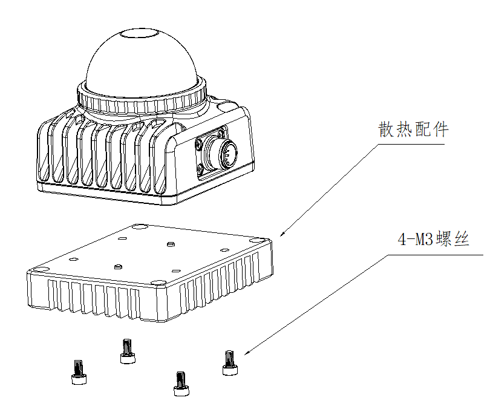
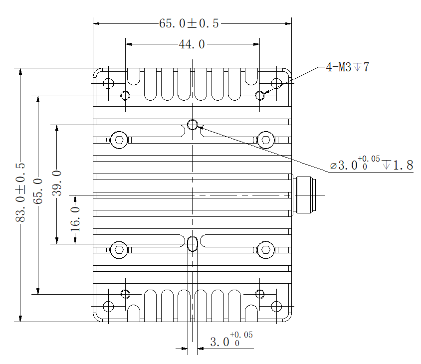
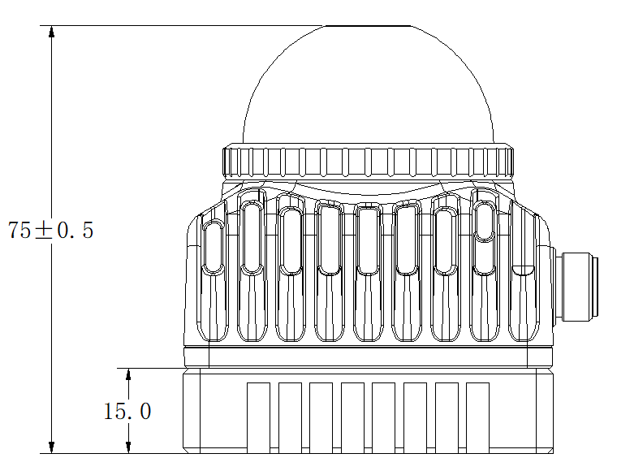
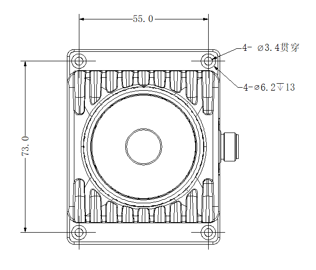
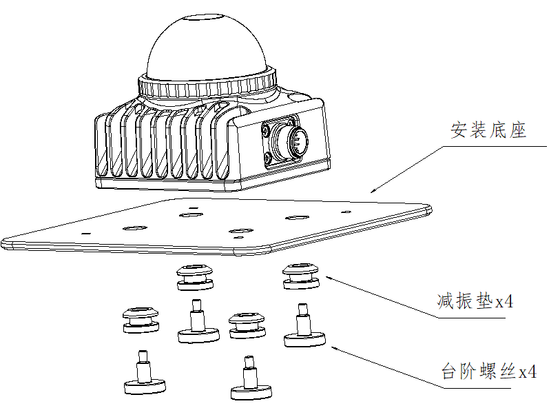
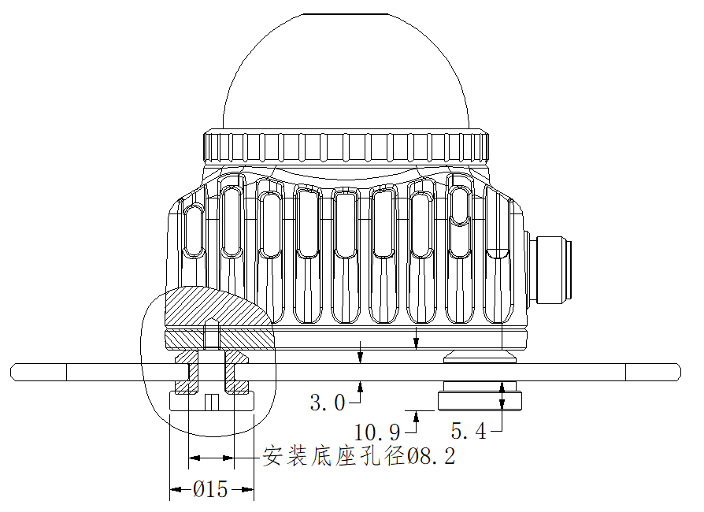

# 散热配件

用户可以购买散热配件以满足60℃环境下工作的需求

## 散热配件安装方式

## 散热配件安装尺寸

# 减震配件

如果发现安装到用户的底座上有较大的振动和噪音问题，比雷达本身的振动噪音要明显的情况，可能是雷达与安装结构发生了共振放大效应。除了调整安装结构模态避免共振放大，也可以制作减振配件，优化振动噪音问题，减振结构和安装示意如下图所示。

## 减震配件安装方式

## 减震配件安装尺寸

**相关设计图纸：**

- [减震设计图纸1](./images/cushioning_design0.jpg)

- [减震设计图纸2](./images/cushioning_design1.jpg)

该文档仅提供设计参考，具体组件要用户根据实际场景需求自行制作

## 减震配件注意事项

1. 安装底座只是安装示意图，不包含于配件中

2. 减振垫与台阶螺丝可与上述的散热配件搭配使用

3. 减振垫的上端有倒角，直接从安装板的底部变形压入，建议安装底座与减振垫的接触面直径大于15mm

4. 安装结构模态应避免和减振结构发生共振，否则起不到减振效果，建议客户测试确认减振效果再正式导入使用

5. 使用减振安装结构之后，雷达的外参波动会比直接固连要大，对外参波动不敏感的客户才推荐使用
