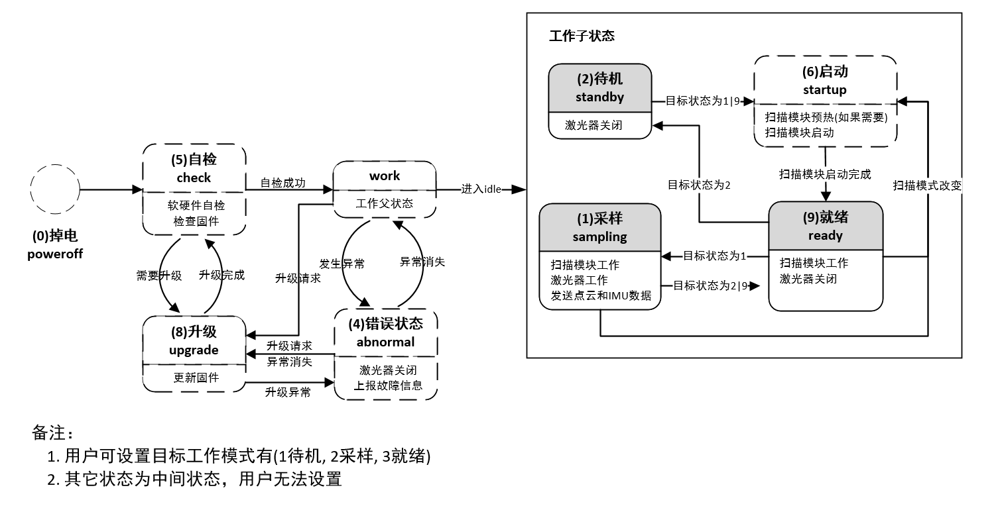
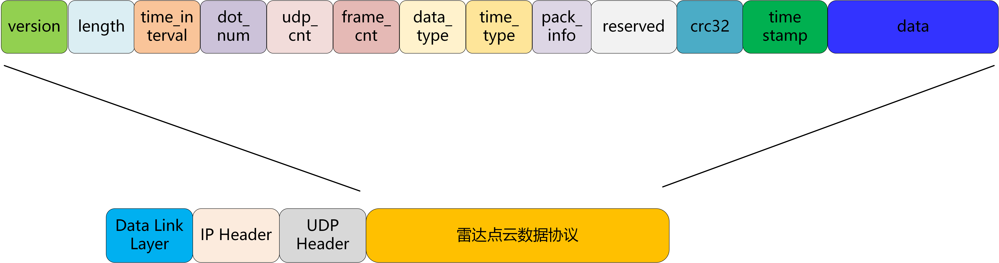
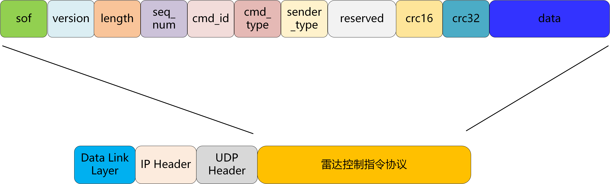
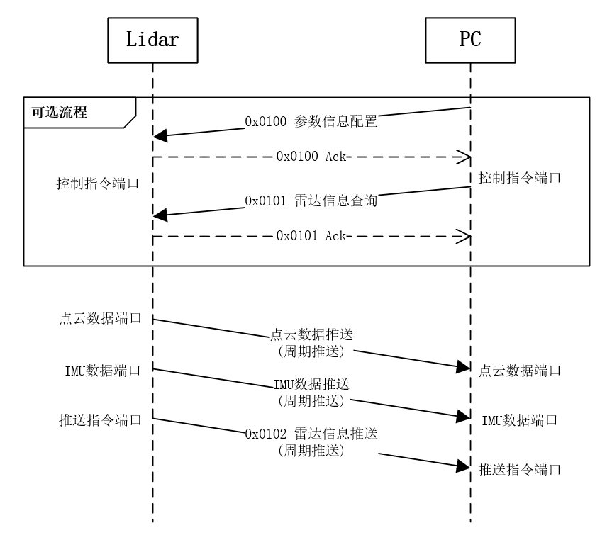

# 激光雷达通信协议--Mid360

| **文件发布历史** |          |                                                              |
| ---------------- | -------- | ------------------------------------------------------------ |
| **日期**         | **版本** | **修改描述**                                                 |
| 20220519         | v1.0     | 1. 内部审核版本                                              |
| 20220530         | v1.1     | 1. 合并状态与参数key_value信息字段 2. 信息推送命令支持推送雷达参数信息及状态信息 |
| 20220602         | v1.2     | 1. 增加log相关命令                                           |
| 20220622         | v1.3     | 1. 56000端口仅支持广播发现命令，广播发现命令ack新增当前雷达的控制指令端口字段 |
| 20220628         | v1.4     | 1. 更新工作状态相关描述                                      |
| 20220629         | v1.4.1   | 1. key value list 增加 firmware type 新键值                  |
| 20220815         | v1.4.2   | 1. key value list增加detect_mode & func_io_cfg               |
| 20220825         | v1.4.3   | 1.点云帧头，增加tag_type描述点云tag类型 2.tag类型增加说明 |
| 20220915         | v1.4.4   | 1. 增加球坐标点云格式描述                                    |
| 20221028         | v1.4.5   | 1. 修改FOV配置描述 2. 修改GPS同步相关描述               |
| 20221114         | v1.4.6   | 1. 增加交互流程描述                                          |
| 20221213         | v1.4.7   | 1. pattern_mode空间扫描模式描述变更                             |
| 20230904         | v1.4.8   | 1. 增加log相关协议描述                                          |
| 20240102         | v1.4.9   | 1. 增加升级错误异常码描述 2. 增加环境温度较高异常码         |
| 20240117         | v1.4.10  | 1. 更新GPS同步时, PPS脉冲的脉宽要求                             |
| 20240222         | v1.4.11  | 1. 增加时间同步斜率相关描述 2. 增加减震，散热相关描述       |

# 协议概述

此文档仅作为livox Mid360雷达产品通信协议

## 协议类型

用户和雷达之间有两种类型的数据协议，功能分别如下：

**点云数据协议：**

- 雷达采样输出的点云数据；

- 雷达内部IMU数据

  详见 [配置雷达参数](#2.3 数据类型) 

**控制指令协议：**

- 配置和查询雷达的参数、雷达复位；

- 雷达状态推送、查询；

- 升级相关;

  详见 [指令详解](#4 指令详解) 

两种协议都被封装在UDP的数据段中，协议数据为**小端序**。

## 雷达工作状态

当前雷达的状态机如下图所示，雷达产品目前已使用的状态枚举值如下：

| 雷达状态     | 枚举值 | 是否支持用户设置       |
| ------------ | ------ | ---------------------- |
| 采样状态     | 0x01   | 支持(通过参数配置指令) |
| 待机状态     | 0x02   | 支持(通过参数配置指令) |
| 错误状态     | 0x04   | 不支持                 |
| 自检状态     | 0x05   | 不支持                 |
| 电机启动状态 | 0x06   | 不支持                 |
| 升级状态     | 0x08   | 支持(通过触发升级动作) |
| 就绪状态     | 0x09   | 支持(通过参数配置指令) |

## 端口说明

按照数据类型分类，对应的源端口和目的端口说明：

| 数据类型   | 传输方向         | 雷达端口  | 上位机端口 | 传输类型 | 传输协议 |
| ------ | ------------ | ----- | ----- | ---- | ---- |
| 设备类型查询 | 雷达 <---->上位机 | 56000 | 任意    | 广播   | UDP  |

**56000作为livox雷达固定监听端口，主要用于上位机通过广播查询设备：**

**1.仅支持设备类型查询命令（cmd_id:0x0000），上位机通过此端口获取雷达具体设备类型。此命令响应通过广播回复，以便于上位机与雷达IP不在同一网段时，上位机仍可识别到雷达**。

Mid-360通信端口：

| 数据类型 | 传输方向         | 雷达端口 | 上位机端口        | 传输类型 | 传输协议 |
| -------- | ---------------- | -------- | ----------------- | -------- | -------- |
| 控制指令 | 雷达<--->上位机  | 56100    | 任意(建议56101)   | 单播     | UDP      |
| 推送指令 | 雷达  --->上位机 | 56200    | 可配置(默认56201) | 默认单播 | UDP      |
| 点云数据 | 雷达  --->上位机 | 56300    | 可配置(默认56301) | 默认单播(支持组播) | UDP      |
| IMU数据  | 雷达  --->上位机 | 56400    | 可配置(默认56401) | 默认单播(支持组播) | UDP      |
| LOG数据  | 雷达<--->上位机  | 56500    | 任意(建议56501)   | 单播     | UDP      |

# 点云&IMU数据协议

## 协议格式

雷达输出点云数据格式：

| 字段          | 偏移量(字节) | 大小 (字节) | 详细描述                                                     |
| ------------- | ------------ | ----------- | ------------------------------------------------------------ |
| version       | 0            | 1           | 包协议版本：当前为0                                          |
| length        | 1            | 2           | 从version开始的整个UDP数据段长度                             |
| time_interval | 3            | 2           | 帧内点云采样时间(单位0.1us) 这帧点云数据中最后一个点减去第一个点时间 |
| dot_num       | 5            | 2           | 当前UDP包data字段包含点数目                                  |
| udp_cnt       | 7            | 2           | 点云UDP包计数，每个UDP包依次加1，点云帧起始包清0         |
| frame_cnt     | 9            | 1           | 点云帧计数，每帧点云(10Hz/15Hz等)依次加1 对于非重复扫描，此字段无效 |
| data_type     | 10           | 1           | 数据类型，详见 [2.3](#2.3 数据类型)                          |
| time_type     | 11           | 1           | 时间戳类型，详见 [2.2](#2.2 时间戳)                          |
| reserved      | 12           | 12          | 保留                                                         |
| crc32         | 24           | 4           | timestamp+data段校验码，使用CRC-32算法(详见 [CRC算法说明](#6 CRC算法说明) ) |
| timestamp     | 28           | 8           | 点云时间戳，详见 [2.2](#2.2 时间戳)                          |
| data          | 36           | --          | 数据信息，详见 [2.3](#2.3 数据类型)                          |

## 时间戳

雷达系统支持GPS同步和PTP网络协议同步；

GPS时间同步可以通过网络UDP包输入，也可以通过串口GPRMC报文输入，详见时间同步说明文档；

PTP时间同步支持IEEE1588v2.0 UDP/IP同步，以及gPTP L2同步；

每个数据包中的时间戳代表第一个点云的时间，每个数据包中有n个点云，这n个点云的时间是等间隔的，总间隔时间为 `time_interval` 的值。

时间戳类型：

| 时间戳类型 | 同步源类型                             | 数据格式 | 说明         |
| ---------- | -------------------------------------- | -------- | ------------ |
| 0          | 无同步源，时间戳为雷达开机时间         | uint64_t | Unit单位: ns |
| 1          | gPTP/PTP同步，时间戳为master时钟源时间 | uint64_t | Unit单位: ns |
| 2          | GPS时间同步                            | uint64_t | Unit单位: ns |

注意：

* GPS时间同步的时间限制范围为2000年-1月1日-00:00到2037年-12月31日
* PTP时间同步不支持IEEE1588v2.1
* 不推荐应用于IEEE1588v2.0与gPTP同时存在的场景中；

## 数据类型

在每个数据包中有N个采样值。N的大小取决于数据类型。

数据类型有以下4种，默认点云数据类型为1：

| 数据类型 | 采样类型  | 回波模式  | 坐标系模式       | N         |
| ---- | ----- | ----- | ----------- | --------- |
| 0    | IMU数据 |       |             |           |
| 1    | 点云数据  | 单回波模式 | 直角坐标系       | 96 |
| 2    | 点云数据  | 单回波模式 | 直角坐标(16bit) | 96 |
| 3    | 点云数据  | 单回波模式 | 球坐标         | 96 |

**数据类型 0**

IMU数据：

| 字段     | 偏移(字节) | 数据类型  | 描述          |
| ------ | ------ | ----- | ----------- |
| gyro_x | 0      | float | Unit: rad/s |
| gyro_y | 4      | float | Unit: rad/s |
| gyro_z | 8      | float | Unit: rad/s |
| acc_x  | 12     | float | Unit: g     |
| acc_y  | 16     | float | Unit: g     |
| acc_z  | 20     | float | Unit: g     |

**数据类型 1**

单回波直角坐标数据格式：

| 字段   | 偏移(字节) | 数据类型    | 描述                                       |
| ---- | ------ | ------- | ---------------------------------------- |
| x    | 0      | int32_t | X 轴，单位: mm                               |
| y    | 4      | int32_t | Y 轴，单位: mm                               |
| z    | 8      | int32_t | Z 轴，单位: mm                               |
| 反射率  | 12     | uint8_t | 反射率                                      |
| 标签   | 13     | uint8_t | 根据点云帧头pack_info.tag_type字段，匹配具体tag类型,详见 [2.4](#2.4 标签信息) |

**数据类型 2**

单回波直角坐标数据格式(16bit)：

| 字段   | 偏移(字节) | 数据类型    | 描述（10mm为16bit格式下分辨率）                     |
| ---- | ------ | ------- | ---------------------------------------- |
| x    | 0      | int16_t | X 轴，单位: 10mm                             |
| y    | 2      | int16_t | Y 轴，单位: 10mm                             |
| z    | 4      | int16_t | Z 轴，单位: 10mm                             |
| 反射率  | 6      | uint8_t | 反射率                                      |
| 标签   | 7      | uint8_t | 根据点云帧头pack_info.tag_type字段，匹配具体tag类型,详见 [2.4](#2.4 标签信息) |

**数据类型 3**

单回波球坐标数据格式:

| 字段   | 偏移(字节) | 数据类型 | 描述                                                         |
| ------ | ---------- | -------- | ------------------------------------------------------------ |
| 深度   | 0          | uint32_t | 深度, 单位: mm                                               |
| 天顶角 | 4          | int16_t  | 天顶角[0, 18000], Unit: 0.01 度                              |
| 方位角 | 6          | int16_t  | 方位角[0, 36000], Unit: 0.01 度                              |
| 反射率 | 8          | uint8_t  | 反射率                                                       |
| 标签   | 9          | uint8_t  | 根据点云帧头pack_info.tag_type字段，匹配具体tag类型,详见 [2.4](#2.4 标签信息) |

## 标签信息

Tag主要指示探测点的其它附加信息。点云标记为8bit 无符号整数，按照bit 划分为几
个区域，每个区域表示此探测点的一种属性，其中包括雨雾灰尘、相近物体间的粘连点云等等；
其中，置信度表示此探测点的可信程度，一般正常点为0（置信度优）；置信度差表示该探测点
受相应属性影响较大，探测结果可信度差；如需要，可据此信息对点云进行过滤，详情如下：

| Bit位   | 描述                                                         |
| ------- | ------------------------------------------------------------ |
| bit 6~7 | 保留位                                                       |
| bit 4~5 | 探测点属性：其它 0：置信度优（正常点） 1：置信度中 2：置信度差 3：保留 |
| bit 2~3 | 探测点属性：雨雾、灰尘等微小颗粒 0：置信度优（正常点） 1：置信度中 2：置信度差 3：保留 |
| bit 0~1 | 探测点属性：相近物体间的粘连点云 0：置信度优（正常点） 1：置信度中 2：置信度差 3：保留 |

# 控制协议

## 协议格式

控制消息协议格式如下：

| 字段          | 偏移(字节) | 大小 (字节) | 描述                                       |
| ----------- | ------ | ------- | ---------------------------------------- |
| sof         | 0      | 1       | 起始字节，固定为 0xAA                            |
| version     | 1      | 1       | 协议版本，当前为0                                |
| length      | 2      | 2       | 数据帧长度 表示从sof开始到整个data段结束的所有字节数，最大值: 1400 |
| seq_num     | 4      | 4       | 每条新的REQ请求消息此字段递增1； ACK回复消息此字段与REQ相同，可用于消息匹配； |
| cmd_id      | 8      | 2       | 不同类型的消息通过此字段进行区分，详见[指令ID](#3.2 指令ID)     |
| cmd_type    | 10     | 1       | 消息类型:  0x00: REQ，表示主动发送的请求消息; 0x01: ACK，表示对CMD请求的回复消息; |
| sender_type | 11     | 1       | 消息发送设备类型：0：表示上位机发送消息，1表示雷达发送消息           |
| resv        | 12     | 6       | 预留拓展字段，可以不关心                        |
| crc_16      | 18     | 2       | 包头校验码，校验内容为从`sof`开始到`crc_16(不包括)`的共18字节数据,  使用CRC-16/CCITT-FALSE算法(详见 [CRC算法说明](#6 CRC算法说明) ) |
| crc32       | 20     | 4       | crc32校验码：data字段校验码,  使用CRC-32算法(详见 [CRC算法说明](#6 CRC算法说明) ) 当data字段长度为0时，CRC32校验码需填充为0. |
| data        | 24     | n       | [指令数据](#4 指令详解)                          |

## 指令ID

雷达指令ID列表：

| 功能分类     | 指令ID | 功能                      |
| ------------ | ------ | ------------------------- |
| 设备类型查询 | 0x0000 | 广播发现                  |
| 雷达信息     | 0x0100 | 参数信息配置              |
|              | 0x0101 | 雷达信息查询              |
|              | 0x0102 | 雷达信息推送              |
| 控制相关     | 0x0200 | 请求设备重启              |
|              | 0x0201 | 恢复出厂设置              |
|              | 0x0202 | 设置雷达GPS时间同步时间戳 |
| log相关      | 0x0300 | log文件推送           |
|              | 0x0301 | log采集配置           |
|              | 0x0302 | log系统时间同步       |
|              | 0x0303 | debug点云采集配置       |
| 通用升级     | 0x0400 | 请求开始升级              |
|              | 0x0401 | 固件数据传输              |
|              | 0x0402 | 固件传输结束              |
|              | 0x0403 | 获取固件升级状态          |

## 交互流程

# 指令详解

## 设备类型查询

### 0x0000 广播发现

请求

| CMD  | 名称   | 偏移(字节) | 数据类型 | 描述   |
| ---- | ---- | ------ | ---- | ---- |
| data | NULL |        |      |      |

应答

| ACK  | 名称            | 偏移(字节) | 数据类型        | 描述                                       |
| ---- | ------------- | ------ | ----------- | ---------------------------------------- |
| data | ret_code      | 0      | uint8_t     | 返回码: (详见 [返回码说明](#5  返回码说明) )         |
|      | dev_type      | 1      | uint8_t     | 雷达类型                                     |
|      | serial_number | 2      | uint8_t[16] | 雷达SN                                     |
|      | lidar_ip      | 18     | uint8_t[4]  | 雷达IP地址  样例: AA.BB.CC.DD  user_ip[0] = AA  user_ip[1] = BB  user_ip[2] = CC  user_ip[3] = DD |
|      | cmd_port      | 22     | uint16_t    | 雷达当前控制指令端口                               |

## 雷达信息

### 0x0100 参数信息配置

请求

| CMD  | 名称             | 偏移(字节) | 数据类型              | 描述                                       |
| ---- | -------------- | ------ | ----------------- | ---------------------------------------- |
| data | key_num        | 0      | uint16_t          | 需要设置的key_value_list信息个数                  |
|      | rsvd           | 2      | uint16_t          |                                          |
|      | key_value_list | 4      | key_value_list[N] | key内容列表； 为了拓展方便，多条信息放在可变长的Key-Value列表中； |

`key_value_list` 中每个配置参数的格式如下：

| 数据域    | 偏移(字节) | 数据类型     | 描述             |
| ------ | ------ | -------- | -------------- |
| key    | 0      | uint16_t | key编号，见下表key编号 |
| length | 2      | uint16_t | key对应的value长度  |
| value  | 4      | --       | key对应的value内容  |

应答

| ACK  | 名称        | 偏移(字节) | 数据类型     | 描述                                |
| ---- | --------- | ------ | -------- | --------------------------------- |
| data | ret_code  | 0      | uint8_t  | 返回码:  (详见 [返回码说明](#5  返回码说明) ) |
|      | error_key | 1      | uint16_t | 配置出错的第一个雷达key                     |

### 0x0101 雷达信息查询

请求

| CMD  | 名称       | 偏移(字节) | 数据类型     | 描述           |
| ---- | -------- | ------ | -------- | ------------ |
| data | key_num  | 0      | uint16_t | key_list信息个数 |
|      | rsvd     | 2      | uint16_t |              |
|      | key_list | 4      | --       | key编号列表      |

`key_list` 中每个key的格式如下：

| 数据域  | 偏移(字节) | 数据类型     | 描述    |
| ---- | ------ | -------- | ----- |
| key  | 0      | uint16_t | key编号 |

应答

| ACK  | 名称             | 偏移(字节) | 数据类型     | 描述                                |
| ---- | -------------- | ------ | -------- | --------------------------------- |
| data | ret_code       | 0      | uint8_t  | 返回码: (详见 [返回码说明](#5  返回码说明) ) |
|      | key_num        | 1      | uint16_t | key_value_list数量                  |
|      | key_value_list | 3      | --       | 查询成功的key信息内容                      |

### 0x0102 雷达信息推送

雷达主动推送

| CMD  | 名称             | 偏移(字节) | 数据类型     | 描述               |
| ---- | -------------- | ------ | -------- | ---------------- |
| data | key_num        | 0      | uint16_t | key_value_list数量 |
|      | rsvd           | 2      | uint16_t |                  |
|      | key_value_list | 4      | --       | info_list列表      |

`key_value_list` 中每个配置参数的格式如下：

| 数据域    | 偏移(字节) | 数据类型     | 描述             |
| ------ | ------ | -------- | -------------- |
| key    | 0      | uint16_t | key编号，见下表key编号 |
| length | 2      | uint16_t | key对应的value长度  |
| value  | 4      | --       | 推送key信息内容      |

`key_value_list`对应的具体含义如下：

| 参数编号（key） | 名称                  | 参数长度 | 参数类型    | 参数内容                                                     | 是否支持参数信息配置命令（cmd_id为0x0100）进行设置 |
| --------------- | --------------------- | -------- | ----------- | ------------------------------------------------------------ | -------------------------------------------------- |
| 0x0000          | pcl_data_type         | 1        | uint8_t     | 雷达点云格式，详见[数据类型](2.3 数据类型)： 0x01: 直角坐标(32bits) 0x02: 直角坐标(16bits) 0x03: 球坐标 | 是                                                 |
| 0x0001          | pattern_mode          | 1        | uint8_t     | 空间扫描模式:  0x00: 非重复扫描 0x01: 重复扫描(暂不支持) 0x02: 低帧率重复扫描模式(暂不支持) 注意：重复扫描模式和低帧率重复扫描模式功能暂不支持，设置后无效，请关注后续固件版本更新； | 是                                                                                       |
| 0x0004          | lidar_ipcfg           | 12       | uint8_t[12] | 雷达IP地址配置 雷达IP地址：AA.BB.CC.DD     data[0]: AA     data[1]: BB     data[2]: CC     data[3]: DD 雷达IPV4 子网掩码     data[4~7] 雷达IPV4 网关     data[8~11] | 是                                                 |
| 0x0005          | state_info_host_ipcfg | 8        | uint8_t[8]  | 雷达状态推送信息的ip地址配置  data[0~3]消息目的IP地址：AA.BB.CC.DD  data[4~5]消息目的端口  data[6~7]rsvd; //预留字段  | 是                                                 |
| 0x0006          | pointcloud_host_ipcfg | 8        | uint8_t[8]  | 雷达点云数据推送的ip地址配置  data[0~3]点云数据目的IP地址：AA.BB.CC.DD  data[4-5]点云数据目的端口  data[6~7]rsvd; //预留字段  | 是                                                 |
| 0x0007          | imu_host_ipcfg        | 8        | uint8_t[8]  | 雷达IMU数据推送的ip地址配置  data[0~3]IMU数据目的IP地址：AA.BB.CC.DD  data[4-5]IMU数据目的端口  data[6~7]rsvd; //预留字段  | 是                                                 |
| 0x0012          | install_attitude      | 24       |             | 雷达在用户装置上的安装位置； 由用户分配，命令和点云中携带此信息，雷达内部不处理此信息； 格式如下： {     float roll_deg;     float pitch_deg;     float yaw_deg;     int x_mm;     int y_mm;     int z_mm; } | 是                                                 |
| 0x0015          | fov_cfg0              | 20       |             | 雷达FOV配置，如果不需要使用全部的FOV，可以在FOV球面上划定一块区域(角度范围)，雷达仅在此区域内采样，其它范围不工作，可以独立配置两块这样的区域，除了配置此参数外，还需要通过fov_cfg_en来使能配置；这是第一块工作区域的配置，其格式如下： struct{     int32_t yaw_start; //航向角起始点，范围[0°~360°)     int32_t yaw_stop; //航向角结束点，范围[0°~360°)     int32_t pitch_start; //俯仰角起始点，范围(-10°~60°)     int32_t pitch_stop; //俯仰角结束点，范围(-10°~60°)      uint32_t rsvd;  //预留字段 }; 注意： 1. 除此配置外，实际发光区域还需要考虑设备实际FOV限制范围 2. 为了避免时间同步问题，FOV外的点仍然会在点云包中，其探测距离为0，反射率为60 | 是                                                 |
| 0x0016          | fov_cfg1              | 20       |             | 同fov_cfg0，这是第二块工作区域的配置                         | 是                                                 |
| 0x0017          | fov_cfg_en            | 1        | uint8_t     | 按Bit划分，用于使能上述两块FOV区域配置； Bit0:  为1表示fov_cfg0有效，为0表示无效  Bit1:  为1表示fov_cfg1有效，为0表示无效 | 是                                                 |
| 0x0018          | detect_mode           | 1        | uint8_t     | 探测模式： 0：正常探测模式 1：敏感探测模式 备注：敏感探测模式增强了对低反射率物体的探测能力，针对极黑或亮面有更出色的探测效果，但同时可能会稍许提升噪点率； | 是                                                 |
| 0x0019          | func_io_cfg           | 4        | uint8_t[4]  | 功能线配置，第0-3个字节分别表示IN0、IN1、OUT0、OUT1管脚的功能，对应Mid360 M12航插管脚序号为8、10、12、11 IN0: 为默认值0，表示用于接PPS信号输入；其他值无效 IN1: 为默认值0，表示用于接GPS报文输入；其他值无效 OUT0: 默认值0，表示无输出(外接上拉电阻)；1表示跟随IN0信号；2表示安全区功能输出0；其他值无效 OUT1: 默认值0，表示无输出(外接上拉电阻)；1表示跟随IN1信号；2表示安全区功能输出1；其他值无效 | 是                                                 |
| 0x001A          | work_tgt_mode         | 1        | uint8_t     | 雷达目标工作模式(即目标工作状态)，详见[雷达状态](#1.2 雷达状态) | 是                                                 |
| 0x001C          | imu_data_en           | 1        | uint8_t     | 0: IMU数据推送关闭 1: IMU数据推动使能                    | 是                                                 |
| 0x8000          | sn                    | 16       | uint8_t[16] | 字符串类型(不足16位使用 '\0' 补齐) 雷达SN(不足16位使用 '\0' 补齐) | 否                                                 |
| 0x8001          | product_info          | 64       | char[64]    | 字符串类型(不足32位使用 '\0' 补齐) 雷达类型+雷达生产日期 示例: "Mid-360 2021/12/01" | 否                                                 |
| 0x8002          | version_app           | 4        | uint8_t[4]  | App固件版本号：aa.bb.cc.dd version_info[0]: aa version_info[1]: bb version_info[2]: cc version_info[3]: dd | 否                                                 |
| 0x8003          | version_loader        | 4        | uint8_t[4]  | Loader固件版本号                                             | 否                                                 |
| 0x8004          | version_hardware      | 4        | uint8_t[4]  | 硬件版本号                                                   | 否                                                 |
| 0x8005          | mac                   | 6        | uint8_t[6]  | 雷达MAC地址：aa:bb:cc:dd:ee:ff data[0]: aa data[1]: bb data[2]: cc data[3]: dd data[4]: ee data[5]: ff | 否                                                 |
| 0x8006          | cur_work_state        | 1        | uint8_t     | 雷达当前工作状态                                             | 否                                                 |
| 0x8007          | core_temp             | 4        | int32_t     | 内核温度(unit: 0.01℃)                                        | 否                                                 |
| 0x8008          | powerup_cnt           | 4        | uint32_t    | 雷达上电次数统计                                             | 否                                                 |
| 0x8009          | local_time_now        | 8        | uint64_t    | 当前设备本地时间                                             | 否                                                 |
| 0x800A          | last_sync_time        | 8        | uint64_t    | 上一次同步的master时间： 如果是PTP同步：此时间是follow_up消息中携带的t1时间 如果是GPS同步：此时间是同步命令中携带的PPS信号上升沿时间 | 否                                                 |
| 0x800B          | time_offset           | 8        | int64_t     | 当前本地时间与同步源的时间偏移，单位ns： 设备本地时间为t0，源时间为t1，则 `time_offset = t0 - t1` | 否                                                 |
| 0x800C          | time_sync_type        | 1        | uint8_t     | 时间同步方式 0：无时间同步 1：PTP时间同步(IEEE 1588v2.0) 2：GPS时间同步  | 否                                                 |
| 0x800E          | error_code            | 2        | uint16_t    | 异常码 模块状态异常等级： 0: normal  1: warning 2: error 3: safety_err struct error_code{ bit0-3:  系统模块 bit4~7: 扫描模块 bit8~11: 测距模快 bit12~15: 通信模块 } |  |
| 0x8010          | FW_TYPE               | 1        | uint8_t     | 固件类型： 0:loader 1:application_image | 否 |
| 0x8011          | hms_code              | 32       | uint32_t[8] | 故障诊断码，每一条非0值代表一条诊断信息，当雷达工作异常时，可通过查询该诊断码确认问题原因； |  |

## 控制相关    

### 0x0200 请求设备重启

请求

| CMD  | 名称      | 偏移(字节) | 数据类型     | 描述        |
| ---- | ------- | ------ | -------- | --------- |
| data | timeout | 0      | uint16_t | 重启延迟时间：ms |

应答

| ACK  | 名称       | 偏移(字节) | 数据类型    | 描述                                |
| ---- | -------- | ------ | ------- | --------------------------------- |
| data | ret_code | 0      | uint8_t | 返回码: (详见 [返回码说明](#5  返回码说明) ) |

### 0x0201 恢复出厂设置

此命令发出后，雷达将恢复出厂设置，回复成功后，雷达将立即重启生效

请求

| CMD  | 名称   | 偏移(字节) | 数据类型        | 描述   |
| ---- | ---- | ------ | ----------- | ---- |
| data | SN   | 0      | uint8_t[16] | 预留字段 |

应答

| ACK  | 名称       | 偏移(字节) | 数据类型    | 描述                                |
| ---- | -------- | ------ | ------- | --------------------------------- |
| data | ret_code | 0      | uint8_t | 返回码: (详见 [返回码说明](#5  返回码说明) ) |

### 0x0202 设置GPS时间同步时间戳

请求

| CMD  | 名称     | 偏移(字节) | 数据类型 | 描述                                                         |
| ---- | -------- | ---------- | -------- | ------------------------------------------------------------ |
| data | type     | 0          | uint8_t  | 时间同步方式： 0-1:保留 2: GPS时间同步          |
|      | time_set | 1          | uint64_t | 若采用GPS同步，此字段应为最近一次PPS信号上升沿的时间，类型为uint64_t，单位为ns  |

应答

| ACK  | 名称       | 偏移(字节) | 数据类型    | 描述                                |
| ---- | -------- | ------ | ------- | --------------------------------- |
| data | ret_code | 0      | uint8_t | 返回码: (详见 [返回码说明](#5  返回码说明) ) |
## log相关
### 0x0300 log文件推送

请求方：雷达

| CMD  | 名称     | 偏移(字节) | 数据类型 | 描述                                                         |
| ---- | ------------ | ---------- | -------- | ------------------------------------------------------------ |
| data | log_type     | 0          | uint8_t  | 日志类型:  0 : 实时log 3 : flash log |
|      | file_index   | 1          | uint8_t  | 文件索引号                                                   |
|      | file_num     | 2          | uint8_t  | log_type为flash log此字段有效，表示flash log文件数目         |
|      | flag         | 3          | uint8_t  | bit 0:  值为1表示需要ack bit 1:  值为1表示创建文件 bit 2:  值为1表示结束文件 注：雷达发送创建文件，发送配置信息头，结束文件数据包时，需要置位ack位 |
|      | timestamp    | 4          | uint32_t | unix时间戳，表示从1970年1月1日00：00：00所经过的秒数。 上位机创建log文件时，通过以下格式命名log文件 log\_<log_type_name>\_<file_index>\_<system_time>.dat 示例: log_fully_log_1_20220613203140.dat    <system_time>为timestamp转换后的系统时间。假如雷达返回的timestamp为0，上位机则不对timestamp进行转换，直接使用上位机系统时间进行命名 |
|      | rsvd         | 8          | uint16_t |                                                              |
|      | trans_index  | 10         | uint32_t | 传输索引号                                                   |
|      | log_data_len | 14         | uint16_t | 日志内容长度                                                 |
|      | log_data     | 16         | --       | 日志内容： 需要追加到文件尾                               |

应答方：上位机

| ACK  | 名称          | 偏移(字节) | 数据类型     | 描述                                |
| ---- | ----------- | ------ | -------- | --------------------------------- |
| data | ret_code    | 0      | uint8_t  | 返回码: (详见 [返回码说明](#5  返回码说明) ) |
|      | log_type    | 1      | uint8_t  |                                   |
|      | file_index  | 2      | uint8_t  |                                   |
|      | trans_index | 3      | uint32_t |                                   |

### 0x0301 log采集配置

请求方：上位机

| CMD  | 名称     | 偏移(字节) | 数据类型 | 描述                                                         |
| ---- | -------- | ---------- | -------- | ------------------------------------------------------------ |
| data | log_type | 0          | uint8_t  | 日志类型:  0 : 实时log 3 : flash log |
|      | enable   | 1          | uint8_t  | 0 : 关闭 1 :  开启                                        |

应答方：雷达

| ACK  | 名称       | 偏移(字节) | 数据类型    | 描述                                |
| ---- | -------- | ------ | ------- | --------------------------------- |
| data | ret_code | 0      | uint8_t | 返回码: (详见 [返回码说明](#5  返回码说明) ) |

### 0x0302 log系统时间同步

请求方：上位机

| CMD  | 名称       | 偏移(字节) | 数据类型     | 描述                                 |
| ---- | --------- | ------ | -------- | ---------------------------------- |
| data | timestamp | 0      | uint32_t | unix时间戳，表示从1970年1月1日00：00：00所经过的秒数 |

应答方：雷达

| ACK  | 名称       | 偏移(字节) | 数据类型    | 描述                                |
| ---- | -------- | ------ | ------- | --------------------------------- |
| data | ret_code | 0      | uint8_t | 返回码: (详见 [返回码说明](#5  返回码说明) ) |

### 0x0303 Debug点云采集配置

请求方：上位机

| CMD  | 名称     | 偏移(字节) | 数据类型 | 描述                                                              |
| ---- | -------- | ---------- | ---------- | ------------------------------------------------------------ |
| data | enable   | 0          | uint8_t    | 0：关闭 1 :  开启                                          |
|      | host_ip  | 1          | uint8_t[4] | Debug点云目的IP地址：AA.BB.CC.DD     data[0]: AA     data[1]: BB     data[2]: CC     data[3]: DD|     
|      | host_port| 5          | uint16_t   | Debug点云目的端口                                               |
|      | reserved| 7          | uint16_t   | 预留|

应答方：雷达

| ACK  | 名称       | 偏移(字节) | 数据类型    | 描述                                |
| ---- | -------- | ------ | ------- | --------------------------------- |
| data | ret_code | 0      | uint8_t | 返回码: (详见 [返回码说明](#5  返回码说明) ) |
## 通用升级

### 0x0400 请求开始升级

请求

| CMD  | 名称              | 偏移(字节) | 数据类型     | 描述                                       |
| ---- | --------------- | ------ | -------- | ---------------------------------------- |
| data | firmware_type   | 0      | uint8_t  | 固件类型： 0：大包固件 1：雷达固件 2：其他固件      |
|      | encrypt_type    | 1      | uint8_t  | 固件加密类型： 0：None encrypt 1：AES128 2：AES256 3：DES 4：3DES |
|      | firmware_length | 2      | uint32_t | 固件总长度                                    |
|      | dev_type        | 6      | uint8_t  | 设备类型： 9：Mid360                          |

应答

| ACK  | 名称       | 偏移(字节) | 数据类型    | 描述                               |
| ---- | -------- | ------ | ------- | -------------------------------- |
| data | ret_code | 0      | uint8_t | 返回码: (详见 [返回码说明](#5  返回码说明) ) |

### 0x0401 固件数据传输

请求

| CMD  | 名称              | 偏移(字节) | 数据类型       | 描述   |
| ---- | --------------- | ------ | ---------- | ---- |
| data | firmware_offset | 0      | uint32_t   |      |
|      | current_length  | 4      | uint32_t   |      |
|      | encrypt_type    | 8      | uint8_t    |      |
|      | rsvd            | 9      | uint8_t[3] |      |
|      | data            | 12     | uint8_t[n] | 固件内容 |

应答

| ACK  | 名称              | 偏移(字节) | 数据类型     | 描述                               |
| ---- | --------------- | ------ | -------- | -------------------------------- |
| data | ret_code        | 0      | uint8_t  | 返回码: (详见 [返回码说明](#5  返回码说明) ) |
|      | current_offset  | 1      | uint32_t |                                  |
|      | received_length | 5      | uint32_t |                                  |

### 0x0402 固件传输结束

请求

| CMD  | 名称              | 偏移(字节) | 数据类型       | 描述   |
| ---- | --------------- | ------ | ---------- | ---- |
| data | checksum_type   | 0      | uint8_t    |      |
|      | checksum_length | 1      | uint8_t    |      |
|      | checksum_data   | 2      | uint8_t[n] |      |

应答

| ACK  | 名称       | 偏移(字节) | 数据类型    | 描述                               |
| ---- | -------- | ------ | ------- | -------------------------------- |
| data | ret_code | 0      | uint8_t | 返回码: (详见 [返回码说明](#5  返回码说明) ) |

### 0x0403 获取固件升级状态

请求

| CMD  | 名称   | 偏移(字节) | 数据类型 | 描述   |
| ---- | ---- | ------ | ---- | ---- |
| data | NULL |        |      |      |
|      |      |        |      |      |

应答

| ACK  | 名称               | 偏移(字节) | 数据类型    | 描述                               |
| ---- | ---------------- | ------ | ------- | -------------------------------- |
| data | ret_code         | 0      | uint8_t | 返回码: (详见 [返回码说明](#5  返回码说明) ) |
|      | upgrade_progress | 1      | uint8_t | 升级进度： 0 ~ 100                 |

# 返回码说明

| 名称                              | 返回值  | 说明                     |
| ------------------------------- | ---- | ---------------------- |
| LVX_RET_SUCCESS                 | 0x00 | 执行成功                   |
| LVX_RET_FAILURE                 | 0x01 | 执行失败                   |
| LVX_RET_NOT_PERMIT_NOW          | 0x02 | 当前状态不支持                |
| LVX_RET_OUT_OF_RANGE            | 0x03 | 设置值超出范围                |
|                                 |      |                        |
| LVX_RET_PARAM_NOTSUPPORT        | 0x20 | 参数不支持                  |
| LVX_RET_PARAM_REBOOT_EFFECT     | 0x21 | 参数需重启生效                |
| LVX_RET_PARAM_RD_ONLY           | 0x22 | 参数只读，不支持写入             |
| LVX_RET_PARAM_INVALID_LEN       | 0x23 | 请求参数长度错误，或ack数据包超过最大长度 |
| LVX_RET_PARAM_KEY_NUM_ERR       | 0x24 | 参数key_num和key_list不匹配  |
|                                 |      |                        |
| LVX_RET_UPGRADE_PUB_KEY_ERROR   | 0x30 | 公钥签名验证错误               |
| LVX_RET_UPGRADE_DIGEST_ERROR    | 0x31 | 固件摘要签名验证错误             |
| LVX_RET_UPGRADE_FW_TYPE_ERROR   | 0x32 | 固件类型不匹配                |
| LVX_RET_UPGRADE_FW_OUT_OF_RANGE | 0x33 | 固件长度超出范围               |
| LVX_RET_UPGRADE_FW_ERASING      | 0x34 | 固件擦除中                  |

# CRC算法说明

| CRC算法名称            | 多项式公式                                    | 宽度   | 多项式        | 初始值        | 结果异或值      | 输入反转  | 输出反转  |
| :----------------- | :--------------------------------------- | :--- | :--------- | :--------- | :--------- | :---- | :---- |
| CRC-16/CCITT-FALSE | x^16^ + x^12^ + x^5^ + 1                 | 16   | 0x1021     | 0xFFFF     | 0x0000     | false | false |
| CRC-32             | x^32^ + x^26^ + x^23^ +    x^22^ + x^16^ + x^12^ +    x^11^ + x^10^ + x^8^ + x^7^ + x^5^ + x^4^ + x^2^ + x + 1 | 32   | 0x04C11DB7 | 0xFFFFFFFF | 0xFFFFFFFF | true  | true  |
