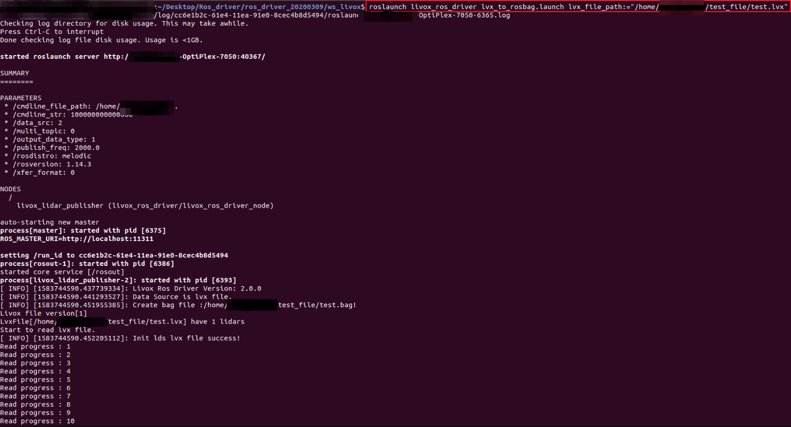

=======================================
数据格式及其转换
=======================================

Livox LiDAR数据格式介绍
-----------------------------

Livox LiDAR支持多种方式连接和存储点云数据，其常用格式如下：

-  bag文件：bag文件是ROS系统常用的点云数据存储格式，Livox LiDAR使用PointCloud2格式和自定义的CustomMsg格式两种。该文件记录了LiDAR扫描过程中每帧点云数据和其他传感器数据。使用ROS连接Livox
   LiDAR可扫描并存储此格式的数据。
-  lvx文件：lvx文件是使用Livox Viewer连接Livox
   LiDAR后存储的点云数据，可在Livox Viewer中查看和编辑。
-  csv文件：逗号分隔值文件，使用Livox Viewer连接Livox
   LiDAR后可将lvx点云数据保存为csv格式。
-  las文件：可用以保存Lidar点数据记录，使用Livox Viewer连接Livox
   LiDAR后可将点云数据保存为las格式。
-  pcd文件：可记录某一帧的点云数据。Livox
   LiDAR记录的数据无法直接保存为pcd格式，需进行转化。

数据格式转化
-----------------------------

lvx文件转rosbag文件并播放
~~~~~~~~~~~~~~~~~~~~~~~~~~~~~~~~~~

-  软件依赖：Ubuntu 16.04、ROS、livox\_ros\_driver (此部分驱动的下载和安装详细过程见 :doc:`驱动 <../../data_summary/Livox_data_summary>`)

livox\_ros\_driver支持将lvx pointcloud数据文件转换为rosbag文件。

在\ ``../ws_livox``\ 下打开终端，编译：

::
   
   $ catkin_make

使用如下命令更新当前ROS包环境：

::
   
   $ source ./devel/setup.bash

再使用以下命令：

::
   
   $ roslaunch livox_ros_driver lvx_to_rosbag.launch lvx_file_path:=""

在上述命令中双引号内填写本地lvx数据文件路径即可成功运行，转换成功后将在上述路径下生成同名的rosbag格式文件,如下图所示：

.. image:: ../../image/lvx_to_rosbag_02.png

得到转化成功后的test.bag文件后，可使用rviz可视化工具播放，步骤如下：

启动ROS：

::
   
   $ roscore

运行rviz：

::
   
   $ rosrun rviz rviz

成功打开rviz后，需添加PointCloud2并选择相应的topic，可使用\ ``rosbag info <filename.bag>``\ 命令查看相应bag文件对应的topic，如下所示：

.. image:: ../../image/rosbag_info.png

在rviz中添加相应topic：

.. image:: ../../image/rviz.png

然后运行rosbag，即可播放：

::

   $ rosbag play <test.bag>

lvx文件转.las或.csv文件
~~~~~~~~~~~~~~~~~~~~~~~~~~~~~~~~~~

-  软件依赖：Livox Viewer（win or ubuntu）

Livox Viewer提供了一个将lvx 文件整体转为一个las 或者csv
文件的转换工具,方便用户处理数据使用。菜单栏中选择 Tools->File Converter
即可打开此工具。

rosbag文件转pcd文件
~~~~~~~~~~~~~~~~~~~~~~~~~~~~~~~~~~

**PointCloud2格式的rosbag文件**

参考：\ http://wiki.ros.org/pcl_ros

软件依赖：Ubuntu 16.04、ROS、PCL

运行ros：

::

   $ roscore

在.bag文件存储路径下打开终端并运行命令：

::

   $ rosrun pcl_ros bag_to_pcd <input_file.bag> <topic> <output_directory>

其中\ ``<input_file.bag>``\ 为需转换的bag文件名称，\ ``<topic>``\ 为该bag文件的topic信息，\ ``<output_directory>``\ 为转化完成后的pcd文件存放地址。

.. image:: ../../image/bag_to_pcd_pcddata.png

在对应文件夹下，可找到由rosbag文件转化而来的每一帧pcd文件，其文件名为当前帧的时间戳：

.. image:: ../../image/testpcd.png

转换完成后，可使用pcl\_viewer查看pcd文件。命令如下：

::

   $ pcl_viewer <filename.pcd>

