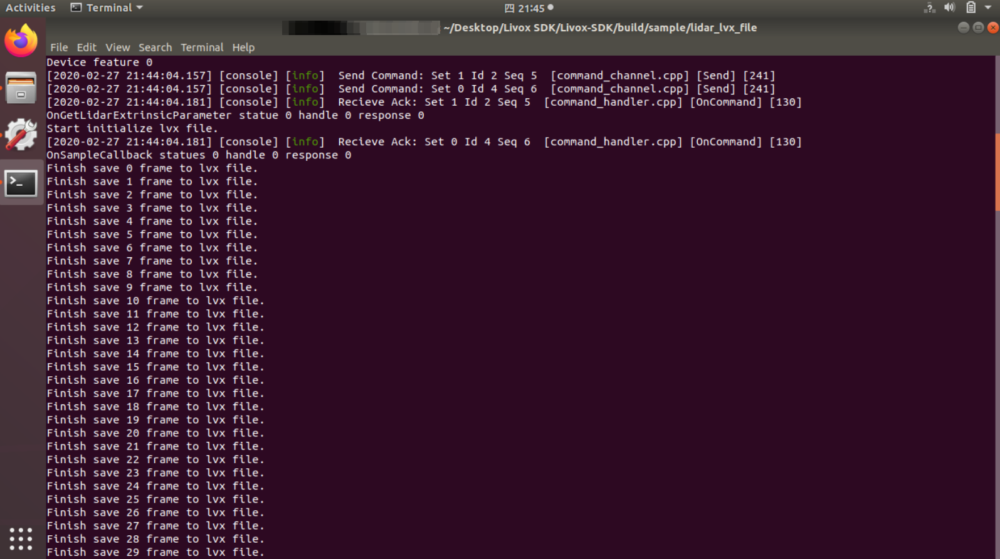

=======================================
单雷达数据采集
=======================================

.. note:: 连接雷达前请注意关闭系统防火墙，否则可能无法连接

使用Livox Viewer采集数据
--------------------------------

以Livox Mid-40为例：

**软件依赖**：Livox_Viewer(此部分软件安装见 :doc:`驱动 <../../data_summary/Livox_data_summary>`)(Win10或Ubuntu)

**硬件部分**：Livox-Mid 40、电源转接插座2.0或连接盒、以太网线、PC。

**连接**：物理连接如下图所示

.. image:: ../../image/one_lidar_connect.png

若对连线及IP配置存在疑问，可参考Livox官网Livox觅道Mid用户手册“连线”部分，下载地址
`Livox觅道Mid用户手册 <https://terra-1-g.djicdn.com/65c028cd298f4669a7f0e40e50ba1131/Download/update/Livox%20Mid%20Series%20User%20Manual%20(CN).pdf>`_

采集：完成硬件连接后，在Ubuntu / Win10下打开Livox Viewer，下载地址如下所示：

`Livox Viewer 0.8.0 for Windows <https://terra-1-g.djicdn.com/65c028cd298f4669a7f0e40e50ba1131/Download/update/Livox%20Viewer%200.8.0.7z>`_ 

`Livox Viewer 0.7.0 For Linux Ubuntu16.04_x64 <https://www.livoxtech.com/3296f540ecf5458a8829e01cf429798e/downloads/Livox%20Viewer/Livox_Viewr_For_Linux_Ubuntu16.04_x64_0.7.0.tar.gz>`_ 

启动终端后进入到解压缩后文件夹的根目录，运行指令``./livox viewer.sh`` 即可启动

若正确的连接了Lidar并完成了IP配置，此时Livox Viewer界面显示如下，左侧显示已连接的Livox Lidar的型号和15位广播码。

.. image:: ../../image/start_Viewer_and_link_Horizon.png

点击按钮启动Lidar,再点击播放按钮即可显示Lidar所采集到的点云图,如下所示：

.. image:: ../../image/capture.png

采集成功后，可点击工具栏上的录制按钮进行lvx格式文件的录制，暂停播放或再次点击此按钮结束录制。

工具栏中包含多个按钮，可进行点云着色方案、点样式大小、帧积分时长等功能设置，详细介绍可见官网Livox
Viewer用户手册。其下载地址为
`Livox Viewer用户手册 <https://www.livoxtech.com/3296f540ecf5458a8829e01cf429798e/downloads/Livox%20Viewer/Livox%20Viewer%20%E7%94%A8%E6%88%B7%E6%89%8B%E5%86%8C.pdf>`_

Livox Viewer录制并保存文件的默认格式为lvx，在菜单中选择File->Save as可将当前点云另存为csv或las文件。

使用ROS采集
-----------------------------

以Livox Mid-40为例：

**软件依赖**：ubuntu 16.04、ROS、Livox-SDK、Livox\_ROS\_driver(此部分驱动的下载和安装详细过程见 :doc:`驱动 <../../data_summary/Livox_data_summary>`)

**硬件部分**：Livox-Mid 40 × 1、电源转接插座2.0或连接盒 × 1、以太网线（百兆或千兆） × 1、PC × 1

**连接**：物理连接如下图所示

.. image:: ../../image/one_lidar_connect.png

若对连线及IP配置存在疑问，可参考Livox官网Livox觅道Mid用户手册“连线”部分，下载地址如下
`Livox 觅道Mid用户手册 <https://terra-1-g.djicdn.com/65c028cd298f4669a7f0e40e50ba1131/Download/update/Livox%20Mid%20Series%20User%20Manual%20(CN).pdf>`_

**采集**：

-  Lvx格式：

首先确认已从Git克隆Livox-SDK

::

   $ git clone https://github.com/Livox-SDK/Livox-SDK.git

完成Lidar硬件及IP配置部分，在以下文件路径下打开终端窗口：

::

   $ ../Livox_SDK/build/sample/lidar_lvx_file

执行以下命令连接Lidar，并设定记录的点云数据的持续时间为10s:

::
   
   $ ./lidar_lvx_sample -c "此处为已连接的Lidar的15位广播码" -t 10

.. image:: ../../image/save_lvx_data_by_SDK_01.png

成功执行后，当前路径下即可生成采集好的lvx文件

.. image:: ../../image/save_lvx_data_by_SDK_03.png

-  bag格式：

.. note:: 由于Horizon雷达内部集成了IMU，因此使用此方法记录Horizon雷达数据时包含两个Topic：分别是CustomMsg格式的点云数据和sensor_msgs/Imu格式的IMU数据。

1.连接好雷达后，在livox_ros_driver所在工作空间打开终端编译并更新当前ROS包环境：

::

   $ catkin_make

   $ source ./devel/setup.sh

2.使用ROS launch文件加载览沃ROS驱动：

::

   $ roslaunch livox_ros_driver livox_lidar_rviz.launch

3.启动rviz并显示雷达画面后，使用record命令记录数据：

::

   $ rosbag record -a
