.. _Livox时间戳同步:

Livox设备时间同步
============================

时间同步说明
------------

Livox设备支持3种时间同步方式：

**PTP**：IEEE 1588v2.0 PTP 网络协议同步；

**GPS**：秒脉冲+GPRMC时间数据，组成GPS时间同步方式；

**PPS**：秒脉冲同步，需要上层应用程序通过其他途径（如：uart）获取每个脉冲的时间信息，并修正点云时间。目前仅LiDAR支持这种同步方式，且由于用法较为复杂，不推荐用户使用这种方式进行LiDAR时间的同步。

不同设备支持的同步方式：

=======================================  =======================================                                      
设备                                      支持的同步方式                           
---------------------------------------  ---------------------------------------                                       
Livox LiDAR                              1.PTP v2   2.GPS   3.PPS（不推荐PPS）                                                       
Livox Hub                                1.PTP v2   2.GPS                              
=======================================  ======================================= 

同步原理
~~~~~~~~~~~~~~~~~~~~~~~~~~~~

PTP时间同步原理
^^^^^^^^^^^^^^^^^^^^^^^^^^^^

同步过程使用IEEE 1588v2.0 PTP的Delay request-response机制（two
steps），Livox设备作为slave端，和master时钟设备进行ptp时间同步。

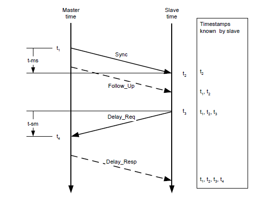

master和slave时钟通过Sync、Follow_Up、Delay_Req、Delay_Resp这几个数据包的交互，得到t1、t2、t3、t4时间，通过如下计算得到传输路径延迟和两时钟的偏移：

传输路径延时：

.. math::
   Delay = [(t4 – t1) – (t3 – t2)]/2

时间偏移：

.. math::
   Offset = (t2 - t1) - Delay = [(t2 – t1) + (t3 – t4)]/2

GPS时间同步原理
^^^^^^^^^^^^^^^^^^^^^^^^^^^^

GPS时钟源的PPS端口每秒发送一次硬件脉冲（PPS信号），随后数据端口发送一次对应这个脉冲上升沿的时间信息（GPRMC格式）。

Livox设备接收到PPS信号上升沿，并由GPRMC数据解析出正确的时间信息后，会设置点云时间为GPS时间，并保持此时间基准持续累加，来实现和GPS设备的时间同步。

-  Livox Hub可以直接接收RS485电平的GPRMC信号；

-  Livox
   LiDAR无法直接接收GPRMC信号，需要将GPRMC数据端口接入PC，然后通过sdk协议发送给雷达；

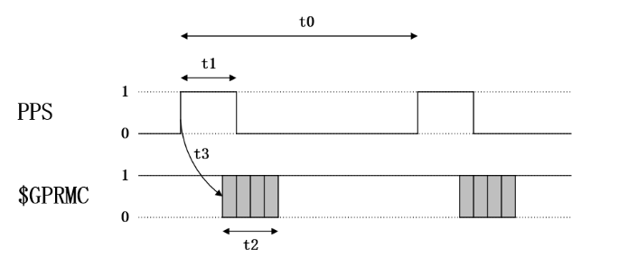

PPS信号和GPRMC信号的时序要求：

=======================================  =======================================  =======================================  =======================================                                        
时间                                      描述                                      有效范围                                  推荐值
---------------------------------------  ---------------------------------------  ---------------------------------------  ---------------------------------------                                         
t0                                       相邻两次秒脉冲上升沿的间隔                    900 ms ~ 1100ms                          1000 ms                                         
t1                                       秒脉冲的高电平时间                          5 ms ~ 900 ms                            10 ms ~ 200 ms
t2                                       GPRMC的传输时间（波特率：9600bps）           ≈ 70 ms                                  70 ms
t3                                       GPRMC数据开始发送相对于脉冲上升沿的延迟        0 ms ~ 900 ms                            0 ms ~ 430 ms
=======================================  =======================================  =======================================  =======================================

应用场景
~~~~~~~~~~~~~~~~~~~~~~~~~~~~

**PTP:**

在没有GPS和PPS硬件信号的情况下，PTP v2可用于Livox
LiDAR/Hub和其他设备之间的时间同步。这种方法所需要的外部硬件支持最少，只需要在整个网络中有一个master时钟设备即可。

**GPS:**

Livox Hub接入多个LiDAR时可以使用这种同步方式，Livox
Hub需要接入GPS接收器的PPS信号，以及GPRMC格式的时间信号，此时LiDAR点云时间会自动修正成GPS时间。

Livox
LiDAR也可以使用GPS同步，但需要将GPRMC信号接入PC，然后通过SDK协议将时间数据发送给LiDAR。

使用方法
------------------------

PTP
~~~~~~~~~~~~~~~~~~~~~

当Livox LiDAR或者Hub连接到有ptp
master时钟的网络中时，设备会自动同步自己的时间到主时钟。

**第一步：检查网络中的master时钟是否正常：**

PC上配置主时钟的方法可参考附录  :ref:`PTP`

如果网络中有Sync、Follow_Up这两个数据，则说明存在PTP
master时钟源，且正常工作：

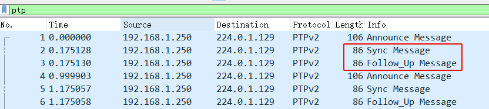

**第二步：连接Livox LiDAR/Hub**

通过网线正常连接Livox LiDAR/Hub即可，无需额外接线。

**第三步：如何查看设备在使用PTP 1588同步**

1、通过查看点云数据包头中的timestamp_type数据， `点云数据协议 <https://github.com/Livox-SDK/Livox-SDK/wiki/Livox-SDK-Communication-Protocol>`_

如果timestamp_type为1，则说明设备正在进行PTP时间同步：

+----------------+-----------+------------+
| timestamp_type | data_type | 时间类型   |
+================+===========+============+
| 1              | uint64_t  | 纳秒（ns） |
+----------------+-----------+------------+

2、或者在Livox Viewer上位机中，查看Settings选项，下图的Sync
State表明Hub在使用ptp 1588同步。

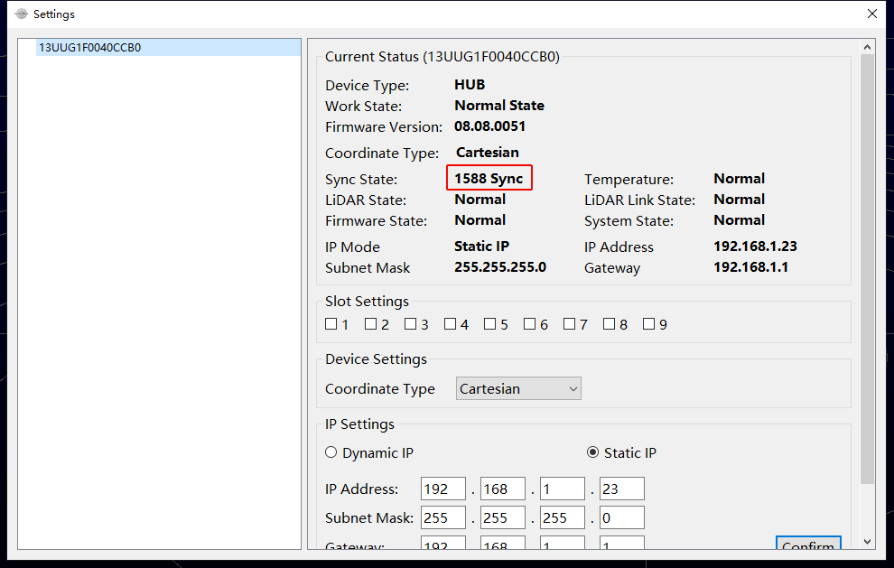

.. note:: 
   -  PTP同步优先级最高，当PTP、PPS或GPS同时可用时，会优先使用PTP网络同步；
   -  不支持具有多个主时钟的网络环境；
   -  百纳秒精度；

GPS
~~~~~~~~~~~~~~~~~~~~~

为了兼容其他厂商的LiDAR硬件，Livox设备也支持GPS时间同步。

由于Livox有不同种类的硬件（LiDAR/Hub），在使用GPS同步时，可以将硬件接口分为3类：

1. 使用Livox Hub；
2. 使用Livox Converter 1.0连接的LiDAR（如：Mid-40、Mid-100）；
3. 使用Livox Converter 2.0连接的LiDAR（如：Tele-15、Horizon）；

下面将分别介绍如何使用这3种接口进行GPS时间同步。

Livox Hub
^^^^^^^^^^^^^^^^^^^^^^^^^^^^^^^^^^

**硬件连接**

如果GPS模块的时间信号和PPS信号是RS485电平，直接将线接入Hub的GPS时间同步口（GPS
sync port）即可。

如果GPS模块的时间信号和PPS信号是TTL电平，则需要进行如下的电平转换后，才能将信号接入Hub的GPS时间同步口（GPS
sync port）。

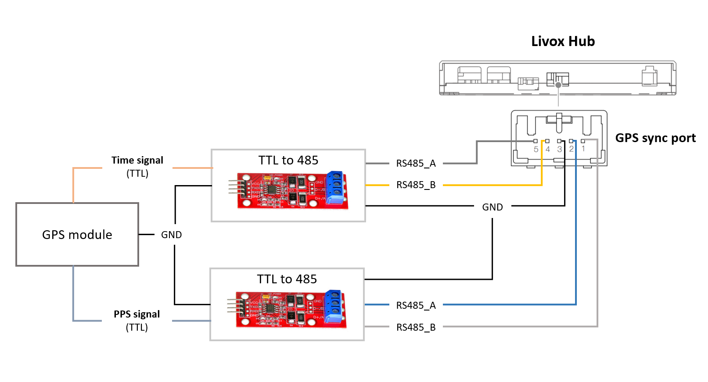

.. note::
   Hub使用GPS同步时，不需要进行SDK软件的配置。

Livox Converter 1.0
^^^^^^^^^^^^^^^^^^^^^^^^^^^

目前默认使用Livox Converter 1.0的设备有：

1. Mid-40
2. Mid-100

**硬件连接**

将GPS模块的时间信号（GPRMC）通过TTL转usb模块接入PC，PPS信号接入LiDAR转接盒同步口（Sync
Port）。

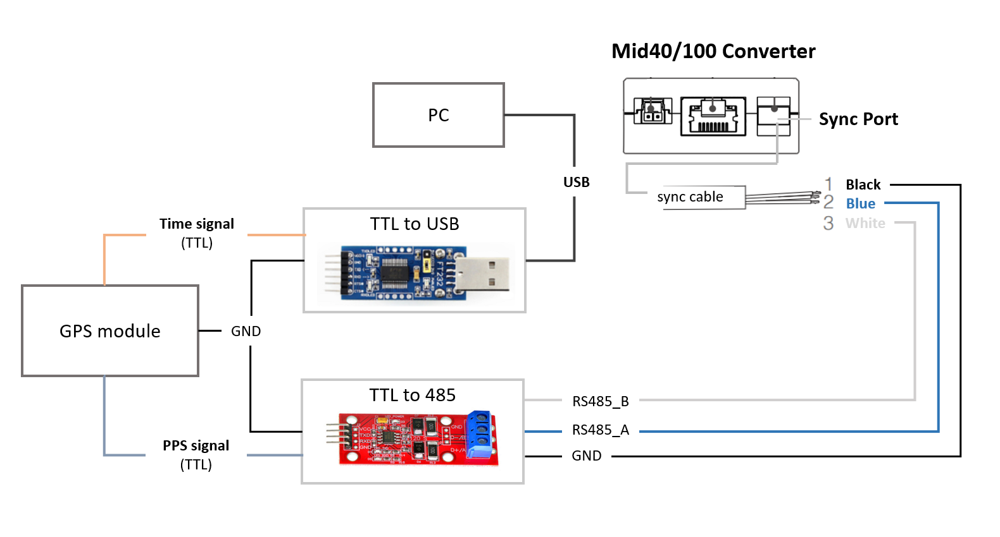

如果GPS模块输出的PPS为RS485电平的信号，则上图可以省略TTL转485模块。

**软件配置**

由于需要PC接收GPRMC数据，然后通过SDK协议发送给LiDAR，对产品的固件版本有如下要求：

-  Mid firmware version: >= **v03.07.0000**
-  SDK version >= **v2.1.0**

**使用ROS driver的情况**

1、按照上面的介绍正确连接硬件；

2、查看接入PC的usb模块的端口名称，例如 ``/dev/ttyUSB0``\ ，添加到
`livox_lidar_config.json <https://github.com/Livox-SDK/livox_ros_driver/blob/master/livox_ros_driver/config/livox_lidar_config.json>`__
文件中“timesync_config”的“device_name”，然后将“enable_timesync”配置为
``true``\ ，波特率“baudrate_index”可以参考 `Livox_ros_driver <https://github.com/Livox-SDK/livox_ros_driver>`_ 来配置具体数值

::

       "timesync_config": {
           "enable_timesync": true,
           "device_name": "/dev/ttyUSB0",
           "comm_device_type": 0,
           "baudrate_index": 2,
           "parity_index": 0
           }

3、运行launch file；

**只使用SDK的情况**

下面的链接是实现GPRMC数据接收和解析，并通过SDK协议发送给LiDAR的程序：

`Livox_SDK_UTC同步 <https://github.com/Livox-SDK/Livox-SDK/tree/master/sample_cc/lidar_utc_sync>`_

Livox Converter 2.0
^^^^^^^^^^^^^^^^^^^^^^^^^^^

目前包装盒中标配使用Livox Converter 2.0的设备有：

1. Horizon
2. Tele-15

**硬件连接**

将GPS模块的时间信号（GPRMC）通过TTL转usb模块接入PC，PPS信号接入LiDAR转接盒同步口（Sync
Port）。

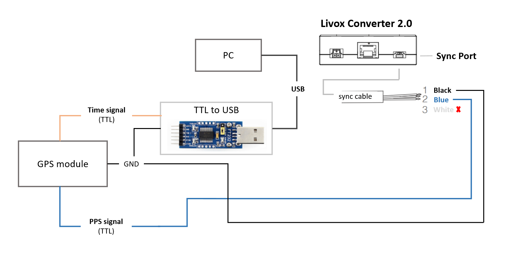

**软件配置**

由于需要PC接收GPRMC数据，然后通过SDK协议发送给LiDAR，对产品的固件版本有如下要求：

-  Horizon firmware version: >= **v06.06.0000**
-  Tele-15 firmware version: >= **v07.09.0000**
-  SDK version >= **v2.1.0**

**使用ROS driver的情况**

1、按照上面的介绍正确连接硬件；

2、查看接入PC的usb模块的端口名称，例如 ``/dev/ttyUSB0``\ ，添加到
`livox_lidar_config.json <https://github.com/Livox-SDK/livox_ros_driver/blob/master/livox_ros_driver/config/livox_lidar_config.json>`__
文件中“timesync_config”的“device_name”，然后将“enable_timesync”配置为
``true``\ ，波特率“baudrate_index”可以参考
`Livox_ros_driver <https://github.com/Livox-SDK/livox_ros_driver>`_ 来配置具体数值

::

       "timesync_config": {
           "enable_timesync": true,
           "device_name": "/dev/ttyUSB0",
           "comm_device_type": 0,
           "baudrate_index": 2,
           "parity_index": 0 
           }

3、运行launch file；

**只使用SDK的情况**

下面的链接是实现GPRMC数据接收和解析，并通过SDK协议发送给LiDAR的程序：

`Livox_SDK_UTC同步 <https://github.com/Livox-SDK/Livox-SDK/tree/master/sample_cc/lidar_utc_sync>`_

状态检查
~~~~~~~~~~~~~~

1、通过查看点云数据包头中的timestamp_type数据，`点云数据协议 <https://github.com/Livox-SDK/Livox-SDK/wiki/Livox-SDK-Communication-Protocol>`_

如果timestamp_type为3，则说明设备正在进行GPS时间同步：

+----------------+----------------+-------------+
| timestamp_type | data_type      | 时间类型    |
+================+================+=============+
| 3              | UTC（8 Bytes） | UTC时间格式 |
+----------------+----------------+-------------+

UTC时间格式：

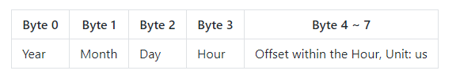

2、或者在Livox Viewer上位机中，查看Settings选项，下图的Sync
State表明Hub在使用GPS同步。

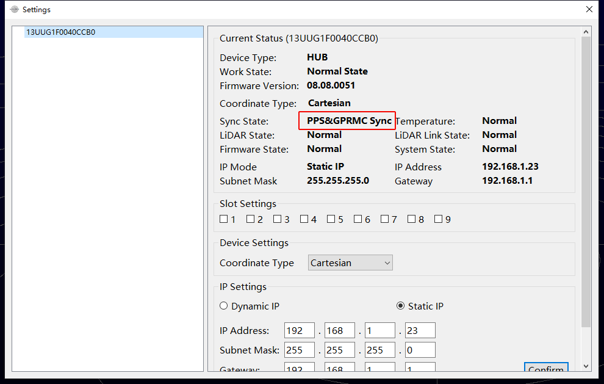

.. note::
   -  通常情况下，GPS模块接收到GPS信号，才能正常输出PPS信号和时间信号。在使用时，需要确保GPS信号是稳定的；
   -  目前时间信号只支持GPRMC/GNRMC这两种格式；
   -  1 us级别精度

PPS
~~~~~~~~~~~~~~~~~~~~~~~~~~~~~~~~~~~~~~~~~~

**由于这个用法较为复杂，不建议使用这种同步方式**

Livox
LiDAR每次接收到PPS信号的上升沿后，会将当前时刻的点云时间置为0，然后重新开始计时直到下一个PPS脉冲到来。我们可以利用这个特性，来实现PPS脉冲对LiDAR时间的同步。

下面是实现这个流程的伪代码：

.. code:: c

   // PPS Time Synchronization
   static uint64_t lidar_time_last;
   static uint64_t lidar_time_real;

   // 1. Read the PPS rising edge time, Unit is nanosecond.
   uint64_t pps_time_ns = get_pps_rising_nsecond();
   // 2. Read LiDAR point time, Unit is nanosecond.
   uint64_t lidar_time = get_lidar_pack_time();
   // 3. Update real time.
   if (lidar_time < lidar_time_last)
   {
       //LiDAR time jump indicates the generation of PPS rising edge.
       lidar_time_real = pps_time_ns + lidar_time%(1000000000);
   }
   else
   {
       lidar_time_real += lidar_time - lidar_time_last;
   }
   //Update history
   lidar_time_last = lidar_time;

.. note::
   用戶需要通过其他方式获得PPS上升沿的时间信息，对应上述代码中的get_pps_rising_nsecond()接口。

附录
------------

.. _PTP:

配置PTP主时钟
~~~~~~~~~~~~~~~~~~~~~~~~~

参考： `The Linux PTP Project <http://linuxptp.sourceforge.net>`_

下载，编译和安装：

.. code:: bash

   git clone http://git.code.sf.net/p/linuxptp/code linuxptp
   cd linuxptp
   make
   sudo make install

如果要让ptp4l正常工作，需要系统的Linux kernel version
3.0或者更新版本。通过下面的指令来检查网卡是否支持软件/硬件时间戳功能（如：查询网卡
‘eth0’ 的状态）。

.. code:: bash

   ethtool -T eth0

下图的例子中，表明eth0网卡支持硬件时间戳。

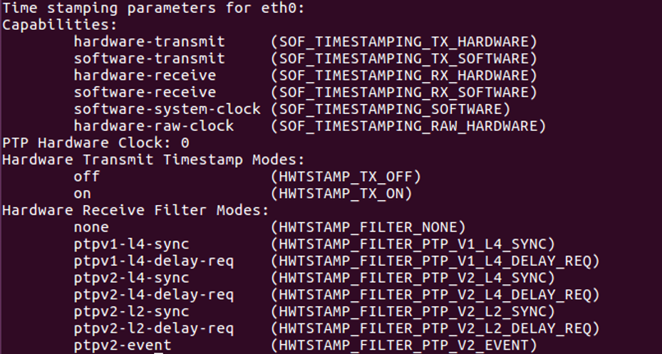

下图的例子中wlan0网卡不支持硬件和软件时间戳，linuxptp/ptp4l不能正常工作。

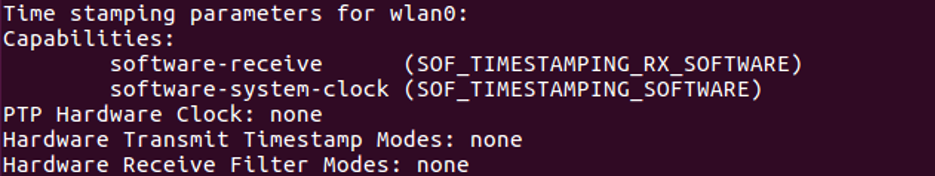

运行如下指令，开启ptp4l的master时钟功能：

.. code:: bash

   sudo ptp4l -i eth0 -l 6 -m

如果网络中出现 ``Sync Message``
数据，说明ptp4l程序的master时钟功能正常运行：

可以使用如下命令让系统时间和PTP硬件时钟同步:

如果需要更多相关的信息, 请参考 `phc2sys链接 <http://manpages.ubuntu.com/manpages/cosmic/man8/phc2sys.8.html>`__

.. code:: bash

   sudo phc2sys -c eth0 -s CLOCK_REALTIME -O 0

完成以上步骤，即可通过ptp4l实现雷达时间和PC本地系统时间的同步。
